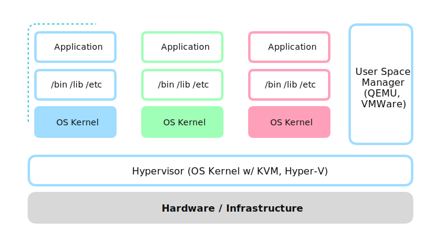
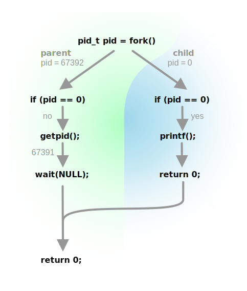

> **Prerequisites**: C Programming Language

因科研需要前段时间在研究Docker等容器化技术, 了解了背后的原理之后大为震撼. 于是决定用C去实现. 此处特别感谢b站up主[造轮子的工程师](https://space.bilibili.com/623241390)的[造轮子系列-手写docker](https://www.bilibili.com/video/BV1tB4y1S7nr/)系列, 给本系列带来非常大的启发.

本文同步更新中/英文版本. 要求: Linux内核, 不限体系结构.

### What is Docker?

**容器化 (Containerization)** 是一个有别于虚拟化(Virtualization)的实现隔离环境的技术. 为什么要隔离环境? 为什么容器化慢慢成为隔离环境的主流?

几乎所有软件都由三个部分组成:

1. 可执行文件(Executable), 包括静态库(Static library)
2. 依赖共享库(Shared library), 又称动态链接库(Dynamic link library) `*.so`
3. 其他文件, 例如配置文件(Config)、缓存和持久存储

共享库的出现避免了可执行文件连接庞大而必要的静态库文件, 例如`libc`, `openssl`等, 使得软件体积更小, 更加容易分发.

操作系统在运行可执行程序时, 首先会加载动态链接器`ld-linux.so.2`到内存中, 然后执行其中的代码. 动态链接器找到并读取程序所需的共享库文件, 并加载到内存中. 然后将程序中对共享库中函数调用等标志转换为共享库对应标志的内存地址, 此时程序就可以正常使用动态链接库中定义的函数等内容了.

此时就遇到了一些问题. 当你下载了所需的可执行文件, 但你并没有所需要的共享库, 要怎么办? 甚至在大型的程序中, 需要其他的可执行文件、配置文件等, 还需要他们在特定的位置, 需要怎么办? 可能需要一大堆程序, 而程序之间依赖库版本不同产生冲突, 怎么办?

此时, **虚拟化技术(Virtualization)** 应运而生. 虚拟化技术允许在一套硬件基础设施(Infrastructure)上运行多个相互隔离的操作系统, 称为**虚拟机** (Virtual Machine, VM), 并允许相互之间通过网络通信.

直接建立在硬件上, 管理VM的操作系统称为Hypervisor, Hypervisor也可通过通用操作系统上的用户程序实现, 称为Type-2 Hypervisor. 常见的Hypervisor包括:

1. [KVM](https://www.linux-kvm.org/page/Main_Page) (Kernel-based Virtual Machine), open-sourced, Linux内核组成部分
2. VMWare® ESXi™, proprietary, 企业级 Type-1 Hypervisor
3. VMWare® Workstation, proprietary, 工作站型 Type-2 Hypervisor
4. Microsoft® Hyper-V

Hypervisor将硬件资源抽象为统一的接口(例如[VirtIO](https://www.linux-kvm.org/page/Virtio)), 使得上方运行的操作系统可在不同的硬件上运行, 程序分发者只需将操作系统、依赖环境和程序打包为一个VM映像 (Image), 即可分发到不同Infrastructure, 甚至相互兼容的不同Hypervisor上. **值得注意的是**, 由于指令构成的Binary无法跨体系结构运行, 所有预编译的操作系统和VM映像也无法在不同的体系结构上运行. 这样就形成了如下的架构:



这样, 每一个VM都带有一个完整操作系统, 可以让不同操作系统、不同ABI (Application Binary Interface, [什么是ABI? 什么是API?](https://en.wikipedia.org/wiki/Application_binary_interface))、不同Calling conventions, 但采用相同指令集的软件在一套硬件上运行, 极大增加了灵活性和可移植性.

然而在实际生产环境中, 绝大多数软件都以Linux内核为基础, 以Linux的ELF ABI作为ABI, . 这样, 在每个VM中的操作系统内核就显得没有那么必要, 会浪费相当大的系统资源. 为何不在linux内核上再建立隔离的系统呢? 容器化 (Containerization) 思想由此诞生.

抛开VM这样自底向上的思想, 即尽可能多的抽象下层设施达到更好的兼容; 我们使用自顶向下的思想, 怎么样利用最少的资源达到隔离各个容器的目的?

1. 我们需要隔离的文件系统, 否则会导致依赖版本冲突、扰乱文件等问题.
2. 我们需要隔离的进程PID空间, 让其他容器中不可见本容器的进程, 避免有些软件的运行会和另一些冲突的问题.
3. 我们需要隔离的用户组, 避免一个容器的用户有更高的权限来操纵其他容器.
4. 我们需要隔离的IPC (Inter-Process Communication)和信号队列, 避免容器间通过IPC的方式互相通讯.
5. 我们需要隔离的网络栈和各自的路由表等, 确保容器间可以通过网络方式通信以及和外界通信.
6. 我们需要隔离的主机名称.

由于Linux万物皆文件的思想, 隔离文件系统为重中之重; 其他部分的原理大概是在隔离的文件系统内创建相应的文件, 例如 `/proc`存储隔离的进程空间, `/etc/hostname`存储主机名等等.

恰巧, Linux内核中的**命名空间 (Namespace)** 使得所有这些隔离成为可能. Linux可对以上六个方面独立的创建若干namespaces, 而每个进程的每一个方面可以在其中一个namespace中运行; 这样, 我们只要将在容器内的一系列进程划分到同样的namespaces里, 而容器间在不同的namespaces中, 即可达到容器化的目的. 注意这里所有的namespace我均用了复数, 要强调的是每个方面的Namespace都是独立的.

### Step 1: Run programs

Linux中, 所有进程都有其父进程, 而通过`fork()`方式创建子进程会继承父进程的namespaces. 所有进程都是PID=1的进程`init`的后代, 所以若不加人为干预, 所有进程均在相同的namespaces中. 可以使用`ps aux`查看进程表.

```bash
[endaytrer@endaytrer-arch ~]$ ps aux
USER         PID %CPU %MEM    VSZ   RSS TTY      STAT START   TIME COMMAND
root           1  0.0  0.0  23288 14520 ?        Ss   Aug13   0:01 /sbin/init
root           2  0.0  0.0      0     0 ?        S    Aug13   0:00 [kthreadd]
root           3  0.0  0.0      0     0 ?        I<   Aug13   0:00 [rcu_gp]
root           4  0.0  0.0      0     0 ?        I<   Aug13   0:00 [rcu_par_gp]
root           5  0.0  0.0      0     0 ?        I<   Aug13   0:00 [slub_flushwq]
root           6  0.0  0.0      0     0 ?        I<   Aug13   0:00 [netns]
root           8  0.0  0.0      0     0 ?        I<   Aug13   0:00 [kworker/0:0H-kblockd]
root          11  0.0  0.0      0     0 ?        I<   Aug13   0:00 [mm_percpu_wq]
root          13  0.0  0.0      0     0 ?        I    Aug13   0:00 [rcu_tasks_kthread]
root          14  0.0  0.0      0     0 ?        I    Aug13   0:00 [rcu_tasks_rude_kthread]
root          15  0.0  0.0      0     0 ?        I    Aug13   0:00 [rcu_tasks_trace_kthread]
root          16  0.0  0.0      0     0 ?        S    Aug13   0:00 [ksoftirqd/0]
root          17  0.0  0.0      0     0 ?        I    Aug13   0:07 [rcu_preempt]
root          18  0.0  0.0      0     0 ?        S    Aug13   0:00 [rcub/0]
```

所以, 为达到隔离的效果, 只需创建一个根进程, 并将其namespaces设置为新的namespaces即可. 如果根进程为shell, 则可以通过命令行的方式在此上面新建新的进程, 并且在同样的namespaces中.

在隔离namespaces之前, 试一下通过最简单的方式创建一个新的进程吧!

```c
#include <unistd.h>
#include <sys/wait.h>
#include <stdio.h>

int main() {
    pid_t pid = fork();
    if (pid < 0) {
        fprintf(stderr, "Fork failed!\n");
        return -1;
    }
    if (pid == 0) {
        // child process
        printf("I am the child!\n");
        sleep(1);
        printf("Child is terminating!\n");
        return 0;
    }
    // parent process
    pid_t parent_pid = getpid();
    printf("I am the parent with pid %d! ", parent_pid);
  	printf("the child's pid is %d\n", pid);
    wait(NULL);
    printf("Child exited.\n");
    return 0;
}
```

`fork()` 函数是一个**call once, return twice**的函数. 若出现错误, 那么不会创建进程, 返回`-1`. 否则的话, 会**在父进程和子进程分别返回**: **父进程**返回**子进程PID**, **子进程**返回**0**. 如下图式为调用关系



调用`fork()`之后, 父进程由于`pid > 0`跳过if语句, 直接执行`gitpid`获取父进程pid; 子进程由于`pid == 0`进入if语句, 执行if中内容.

使用`wait()` syscall, 父进程会等待子进程结束后才继续执行; wait同时返回子进程的返回代码, 可以以此判断子进程是否正常退出.

```bash
$ gcc -o main main.c
$ ./main
I am the parent with pid 67936! the child's pid is 67937
I am the child!
Child is terminating!
Child exited.
```

在fork之后, 子进程执行的依旧是同样程序的代码; 需要通过`exec()`来执行一个可执行文件. `exec` syscall对应libc中很多的函数, 如`execl, execlp, execle, execv, execvp, execvpe`. 此处用的是` int execv(const char *pathname, char *const argv[])`, 执行`pathname`指定程序, 并且传入argument vector `argv`.

```c
#include <unistd.h>
#include <sys/wait.h>
#include <stdio.h>

int main(int argc, char *argv[]) {
    if (argc <= 1) {
        fprintf(stderr, "Usage: main PROGRAM [args]\n");
        return -1;
    }
    pid_t pid = fork();
    if (pid < 0) {
        fprintf(stderr, "Fork failed!\n");
        return -1;
    }
    if (pid == 0) {
        // child process
        printf("I am the child!\n");
        execv(argv[1], argv + 1);
        fprintf(stderr, "Exec failed!\n");
        return -1;
    }
    // parent process
    pid_t parent_pid = getpid();
    printf("I am the parent with pid %d! ", parent_pid);
  	printf("the child's pid is %d\n", pid);
    wait(NULL);
    printf("Child exited.\n");
    return 0;
}
```

此处我们引入了`int argc`和`char *argv[]`, 并将`argv[1]`作为程序路径. 这里使用`argv + 1`指向argv的第1个位置 (从0开始计数). 这样, 使用`main /bin/ps aux` 即相当于运行`/bin/ps`, 且带有参数列表`["/bin/ps", "aux"]`.

`exec()`系列函数的特点是**called once, never returns**. 若出现错误, 那么不会创建进程, 返回. 否则, 会让本进程执行指定的程序. 由于执行的程序已经不是原来的程序了, 所以若没有错误的话, `exec()`之后的代码都不会执行. 相较而言, 父进程跳过了if代码块, 可以继续通过wait方式等待子进程结束.

```bash
$ gcc -o main main.c
$ ./main /bin/ps aux
I am the parent with pid 70096! the child's pid is 70097
I am the child!
USER         PID %CPU %MEM    VSZ   RSS TTY      STAT START   TIME COMMAND
root           1  0.0  0.2 178136  9536 ?        Ss   Aug11   0:06 /sbin/init
root           2  0.0  0.0      0     0 ?        S    Aug11   0:00 [kthreadd]
root           3  0.0  0.0      0     0 ?        I<   Aug11   0:00 [rcu_gp]
root           4  0.0  0.0      0     0 ?        I<   Aug11   0:00 [rcu_par_gp]
root           5  0.0  0.0      0     0 ?        I<   Aug11   0:00 [slub_flushwq]
root           6  0.0  0.0      0     0 ?        I<   Aug11   0:00 [netns]
...
endaytr+   70096  0.0  0.0   2200   760 pts/3    S+   00:57   0:00 ./main /bin/ps aux
endaytr+   70097  100  0.1  11268  4432 pts/3    R+   00:57   0:00 /bin/ps aux
Child exited.
```

### Use `clone` Instead of `fork` to Setup Namespaces

使用fork和exec创建进程之后, 可以使用允许带有命名空间flag的`clone`代替`fork`. 

clone和fork有些不同的是, clone需要手动设定子进程的栈空间, 并且需要传入标志`SIGCHLD`以声明其为子进程. 同时, 不像`fork`会返回两次, clone会传入子进程运行的函数指针: 子进程不再返回到调用的函数内, 而是直接执行传入的函数.

```c
int clone(int (*fn)(void *_Nullable), void *stack, int flags, void *_Nullable arg)
```

调用`clone`时, 子进程进行函数`fn`并接受从`void *_Nullable arg` 传来的参数, 并且以stack作为栈顶; 父进程返回子进程的pid.

在给子进程分配栈空间时, 需要使用`mmap`创建一块栈空间(通常为1MiB), 然后将一个指针指向这块空间的最高地址处; 这个指针即可传入`clone`的参数中:

```c
void *child_stack = mmap(NULL, STACK_SIZE, PROT_READ | PROT_WRITE, MAP_PRIVATE | MAP_ANONYMOUS | MAP_STACK, -1, 0);
void *stack_top = (void *)((uint64_t)child_stack + STACK_SIZE);
```

对其他部分稍加改动, 即可实现clone版本的运行:

```c
#define _GNU_SOURCE
#include <sched.h>
#include <stdint.h>
#include <sys/mman.h>
#include <unistd.h>
#include <sys/wait.h>
#include <stdlib.h>
#include <stdio.h>
#define STACK_SIZE 0x100000

int child(void *arg) {
    printf("I am the child!\n");
    char **argv = (char **)arg;
    execv(argv[0], argv);
    fprintf(stderr, "Exec failed!\n");
    return -1;
}

int main(int argc, char *argv[]) {
    if (argc <= 1) {
        fprintf(stderr, "Usage: main PROGRAM [args]\n");
        return -1;
    }
    void *child_stack = mmap(NULL, STACK_SIZE, PROT_READ | PROT_WRITE, MAP_PRIVATE | MAP_ANONYMOUS | MAP_STACK, -1, 0);
    void *stack_top = (void *)((uint64_t)child_stack + STACK_SIZE);
    int clone_flags = SIGCHLD;
    int pid;
    if ((pid = clone(child, stack_top, clone_flags, (void *)(argv + 1))) < 0) {
        fprintf(stderr, "Clone failed!\n");
        return -1;
    }
    // parent process
    pid_t parent_pid = getpid();
    printf("I am the parent with pid %d! ", parent_pid);
  	printf("the child's pid is %d\n", pid);
    wait(NULL);
    printf("Child exited.\n");
    return 0;
}
```

运行结果和fork版本一致.

