---
title = "Algebraic Decision Diagrams and Quantum Algorithms"
created = 2026-07-24
license = "CC BY-SA 4.0"
---

For research reasons, I have been exploring algebraic decision diagrams (ADDs) and their applications in quantum algorithms. The operations on ADDs are quite intriguing, and the ideas behind them are fascinating. In this blog post, I will share some insights and findings from my exploration of ADDs and their usage in quantum gates and algorithms.

## Algebraic Decision Diagrams (ADDs)

Like binary decision diagrams (BDDs), ADDs are a data structure used to represent Boolean functions. However, ADDs extend BDDs by allowing for the representation of functions that map Boolean variables to real (and even complex, as used in this blog post) numbers, rather than just true/false values.

Note that each branching point in an ADD is still binary, meaning ADDs are a representation of **multi-valued** boolean functions:

$$
ADD: \{0, 1\}^n \to \mathbb{C}
$$

For example, consider a function $f(x_1, x_2): \{0, 1\}^2 \to \mathbb{C}$ which have the following values:

- $f(0, 0) = 1$
- $f(0, 1) = 1$
- $f(1, 0) = 1$
- $f(1, 1) = -1$

It can be represented as an ADD[^1] as follows:

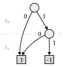

I hereby clarify some terminologies used in this blog post:

- A **node** in an ADD is a branching point that represents a variable and has two outgoing edges corresponding to the variable being true or false.
- A **ply** is a level in the ADD corresponding to a specific variable in the function.
- A **terminal node** is a leaf node that represents the output value (a complex number in ADD) of the function for a specific assignment of variables. Unlike BDDs, there can be more than two terminal nodes in an ADD, as the output can take on multiple values.
- An **edge** is a connection between nodes, representing the transition from one variable to another based on the variable's value. An edge can also connect nodes in non-adjacent plies (i.e. "ply-skipping").

[^1]: By ADD / BDD without additional specification, we mean a reduced ordered ADD / BDD (ROBDD / ROADD), which is a canonical representation of the function.

### ADD representation of vectors and matrices

Let's take a look at a matrix:

$$
H_2 = \begin{bmatrix}
1 & 1\\
1 & -1\\
\end{bmatrix}
$$

It essentially can be seen as a function $f: [0, m) \times [0, n) \to \mathbb{C}$, with the input being its coordinates and the output being the corresponding matrix entry:

$$
M = \begin{bmatrix}
f(0, 0) & f(0, 1) & \cdots & f(0, n-1)\\
f(1, 0) & f(1, 1) & \cdots & f(1, n-1)\\
\vdots & \vdots & \ddots & \vdots\\
f(m-1, 0) & f(m-1, 1) & \cdots & f(m-1, n-1)\\
\end{bmatrix}
$$

With its dimensions $m \times n$ restricted to $2\times 2$, it becomes a multi-valued 2-D boolean function. Thus, we can represent $H_2$ as an ADD.

For example, $H_2(0, 0) = 1$, $H_2(0, 1) = 1$, $H_2(1, 0) = 1$, and $H_2(1, 1) = -1$, which is exactly the same as the function $f$ we defined earlier. Therefore, the ADD representation of $H_2$ is the same <a href="#add-example">the one</a> shown above.

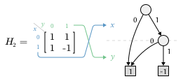

Note that we use $x$ to represent the row index and $y$ to represent the column index in the ADD representation of matrices; and follows a row-first order.

#### Extend to $2^n \times 2^n$ matrices

Consider a $4 \times 4$ matrix $H_4$:

$$
H_4 = \begin{bmatrix}
1 & 1 & 1 & 1\\
1 & -1 & 1 & -1\\
1 & 1 & -1 & -1\\
1 & -1 & -1 & 1\\
\end{bmatrix}
$$
It's coordinate range is $[0, 4) \times [0, 4)$. Although we cannot represent it by 2 boolean values, we can represent its coordinates by binary numbers. For example, coordinate $(2_{10}, 3_{10})$ can be represented as $(10_2, 11_2)$. Therefore, we can represent the coordinates of $H_4$ using 4 boolean variables: $x_0$, $x_1$, $y_0$, and $y_1$. $x_0$ and $x_1$ represent the row index, while $y_0$ and $y_1$ represent the column index.

Similarly, any $2^n \times 2^n$ matrix can be represented by $2n$ boolean variables, with $x_0, x_1, \ldots, x_{n-1}$ representing the row index, and $y_0, y_1, \ldots, y_{n-1}$ representing the column index. We order the variables as $x_0, y_0, x_1, y_1, \ldots, x_{n-1}, y_{n-1}$. The ordering is a bit unintuitive, but I will explain the reason behind it later.

#### Vectors

Vectors are much simpler. As they only have one dimension, we can represent a vector of size $2^n$ using $n$ boolean variables. For example, a vector of size 4 can be represented by 2 boolean variables: $y_0$ and $y_1$. The ordering of the variables is straightforward, as we only need to consider the row index.

Note that we use $y$, not $x$, to represent the index of vectors in the ADD representation.

### Matrix / vector operations in ADD

#### Scalar multiplication $kA$

The entries in a matrix or vector is solely represented by the terminal nodes in the ADD. Therefore, scalar multiplication can be easily implemented by multiplying the terminal nodes by a scalar $k$.

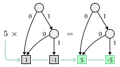

#### Kronecker product $A \otimes B$

Kronecker product is a binary operation on matrices, denoted by $\otimes$. Given two matrices $A$ and $B$ with dimensions $m \times n$ and $p \times q$ respectively, the Kronecker product $A \otimes B$ is a $(m \cdot p) \times (n \cdot q)$ matrix, formed by multiplying each element of $A$ by the entire matrix $B$:

$$
A \otimes B = \begin{bmatrix}
a_{(0,0)}B & a_{(0,1)}B & \cdots & a_{(0,n-1)}B\\
a_{(1,0)}B & a_{(1,1)}B & \cdots & a_{(1,n-1)}B\\
\vdots & \vdots & \ddots & \vdots\\
a_{(m-1,0)}B & a_{(m-1,1)}B & \cdots & a_{(m-1,n-1)}B\\
\end{bmatrix}
$$

For example, consider $I_2 \otimes H_2$ ($I_k$ is the $k \times k$ identity matrix):
$$
I_2 \otimes H_2 = \begin{bmatrix}
1 \cdot H_2 & 0 \cdot H_2\\
0 \cdot H_2 & 1 \cdot H_2\\
\end{bmatrix} = \begin{bmatrix}
1 & 1 & 0 & 0\\
1 & -1 & 0 & 0\\
0 & 0 & 1 & 1\\
0 & 0 & 1 & -1\\
\end{bmatrix}
$$

We can also define Kronecker exponentiation $A^{\otimes n}$, which is the Kronecker product of $n$ copies of $A$.

Just like matrix product, Kronecker product are **associative** and **distributive** w.r.t. addition and substraction:
$$
A \otimes (B \otimes C) = (A \otimes B) \otimes C\\
A \otimes (B + C) = A \otimes B + A \otimes C\\
(B + C) \otimes A = B \otimes A + C \otimes A\\
$$
The operation is also bilinear, meaning that for any scalars $k$, we have:
$$
(kA) \otimes B = A \otimes (kB) = k(A \otimes B)
$$

Previously, we are widely using $H_2$ and $H_4$ as examples. In fact, they are the **Hadamard matrices**, which can be defined recursively as follows:

$$
\begin{aligned}
H_1 &= \begin{bmatrix} 1 \end{bmatrix}\\
H_2 &= \begin{bmatrix} 1 & 1\\ 1 & -1 \end{bmatrix}\\
H_{2^n} &= H_2 \otimes H_{2^{n-1}}
\end{aligned}
$$

or, considering $I_1 = [1]$ is the identity element of Kronecker product, we can also define Hadamard matrices as follows:

$$
H_{2^n} = H_2^{\otimes n}
$$

Hadamard matrices are widely used in quantum algorithms. The most basic quantum gate is the Hadamard gate, which is represented by:
$$
H = \frac{1}{\sqrt{2}} H_2
$$

##### Kronecker product in ADD

As previously discussed, the ADD representation of a $2^n \times 2^n$ matrix uses $2n$ boolean variables, and $x$ and $y$ are interleaved. Let's see how each bit represents the location of the corresponding entry in the $4 \times 4$ matrix $H_4$:

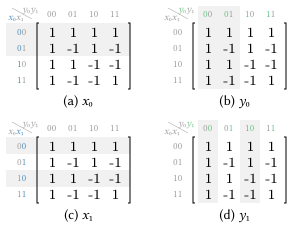

We can see that the first two bits $x_0$ and $y_0$ defines a $2 \times 2$ grid in the matrix, dividing the two axes into two halves. The next two bits $x_1$ and $y_1$ further divides each of the four quadrants into four smaller quadrants, resulting in a total of 16 smaller quadrants, each corresponding to a single entry in the matrix.

Comparing to $H_2$, where the two bits $x$ and $y$ also defines a $2 \times 2$ grid in the matrix, we can conclude that:

1. Given a $2^n \times 2^n$ matrix, $x_0$ and $y_0$ define the first $2 \times 2$ grid in the matrix;
2. For all $i \in [1, n)$, $x_i$ and $y_i$ define a $2 \times 2$ sub-grid of the grid defined by $x_{i-1}$ and $y_{i-1}$.
3. To further divide the $2^n \times 2^n$ matrix into $2^{n+1} \times 2^{n+1}$ matrix, we can add two more bits $x_n$ and $y_n$ in the ADD representation, which splits each entry in the $2^n \times 2^n$ matrix into a $2 \times 2$ grid, resulting in a total of $2^{n+1} \times 2^{n+1}$ entries.

This fractal-like structure of the ADD representation makes it very convenient to implement the Kronecker product. Given two matrices $A_{2^n\times 2^n}$ and $B_{2^m\times 2^m}$, we can utilize property 3 to further divide each entry in $A$ into a $2^m \times 2^m$ grid, resulting in a $2^{n+m} \times 2^{n+m}$ matrix. Here is the detailed operation of the Kronecker product $A \otimes B$ in ADD:

1. Take the ADD representation of $A$, which uses $2n$ boolean variables: $x_0, y_0, x_1, y_1, \ldots, x_{n-1}, y_{n-1}$.
2. Trace down the ADD of $A$ to the terminal nodes, denote its terminal value $a$.
3. For each terminal node with value $a$, multiply the ADD representation of $B$ by $a$, and replace the terminal node with the resulting ADD of $aB$.
4. Merge the final ADD's terminal nodes with the same value, and reduce the ADD according to the ROBDD / ROADD rules.

The following diagram shows the Kronecker product $H_2 \otimes H_2 = H_4$ in ADD:

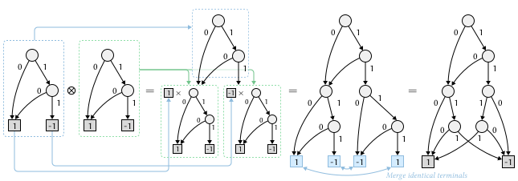

#### Application of 2-operand operators

Many operations, such as matrix addition, subtraction, and pairwise multiplication, can be seen as applying an operation to each pair of entries that share the same coordinates in two matrices. Therefore, any pairwise operation $op$ can be represented as:
$$
A \mathbin{ op } B = op(A \times B)
$$

where $\times$ is the Cartesian product of the two matrices: $\forall i, j \left((A\times B)_{(i, j)} = (A_{(i, j)}, B_{(i, j)})\right)$

##### Cartesian product in ADD

For $A \times B$ to make sense, $A$ and $B$ must share the same coordinate range, and therefore the same variables in the same order (e.g. $x_0, y_0, \ldots, x_{n-1}, y_{n-1}$ for $2^n \times 2^n$ matrices). Unlike the Kronecker product, the Cartesian product does not grow the coordinate space: the branching structure on $x$ and $y$ stays the same, and only the terminal nodes change, each one now holding a pair $(a, b)$ instead of a single value.

For example, given $H_2$ and
$$
B = \begin{bmatrix} 2 & 3\\ 4 & 5\end{bmatrix}
$$
their Cartesian product is
$$
H_2 \times B = \begin{bmatrix} (1, 2) & (1, 3)\\ (1, 4) & (-1, 5)\end{bmatrix}
$$
Mapping $+$ over every terminal pair then recovers $H_2 + B$.

This "keep the shape, pair up the terminals" description translates directly into an algorithm: walk the ADDs of $A$ and $B$ together, ply by ply, and only build a terminal once both sides have reached one.

1. Start at the root node of $A$ and the root node of $B$.
2. If both current nodes are terminal nodes, with values $a$ and $b$ respectively, the result is a terminal node with value $(a, b)$.
3. Otherwise, let $v$ be the variable of the current ply. For each of the two nodes, take its false and true edges as usual if it branches on $v$. If instead it skips $v$ (either because it is a ply-skipping edge to a later variable, or because it has already reached a terminal), treat both its false and true edges as pointing back to itself, i.e. as if it were a redundant node on $v$.
4. Recurse on the pair of false edges and the pair of true edges separately, and create a new node on $v$ whose false and true edges point to the two results.

    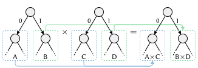

5. Merge terminal nodes with the same pair value, and reduce the resulting ADD according to the ROBDD / ROADD rules.

Since step 3 only ever advances to the immediate children of the current pair, and every recursive call operates on a pair of nodes drawn from $A$'s and $B$'s own node sets, memoizing on that pair keeps the traversal efficient even though it walks two ADDs at once.

Once $A \times B$ is built, any pairwise operator $op$, addition, subtraction, entrywise product, or anything else that only looks at $(a, b)$, reduces to applying $op$ to every terminal pair, the same way scalar multiplication applied $k\cdot$ to every terminal earlier.

#### Matrix-vector multiplication $Av$

One final important operation is matrix-vector multiplication, which is widely used in quantum algorithms. Given a $2^n \times 2^n$ matrix $A$ and a vector $v$ of size $2^n$, the result of the multiplication $Av$ is a vector of size $2^n$, with each entry being the dot product of the corresponding row in $A$ and the vector $v$:

$$
\begin{bmatrix}
a_{(0, 0)} & a_{(0, 1)} & \cdots & a_{(0, 2^n-1)}\\
a_{(1, 0)} & a_{(1, 1)} & \cdots & a_{(1, 2^n-1)}\\
\vdots & \vdots & \ddots & \vdots\\
a_{(2^n-1, 0)} & a_{(2^n-1, 1)} & \cdots & a_{(2^n-1, 2^n-1)}\\
\end{bmatrix} \begin{bmatrix}
v_0\\
v_1\\
\vdots\\
v_{2^n-1}\\
\end{bmatrix} = \begin{bmatrix}
\sum_{j=0}^{2^n-1} a_{(0, j)} v_j\\
\sum_{j=0}^{2^n-1} a_{(1, j)} v_j\\
\vdots\\
\sum_{j=0}^{2^n-1} a_{(2^n-1, j)} v_j\\
\end{bmatrix}
$$

We can express the result vector as a row-wise sum of a $2^n \times 2^n$ matrix. Let $\operatorname{rowsum}$ denote the operator that sums each row of a matrix into a single entry, mapping a $2^n \times 2^n$ matrix $M$ to the column vector whose $x$-th entry is $\sum_{y=0}^{2^n-1} M_{(x, y)}$:

$$
Av = \operatorname{rowsum} \begin{bmatrix}
a_{(0, 0)} v_0 & a_{(0, 1)} v_1 & \cdots & a_{(0, 2^n-1)} v_{2^n-1}\\
a_{(1, 0)} v_0 & a_{(1, 1)} v_1 & \cdots & a_{(1, 2^n-1)} v_{2^n-1}\\
\vdots & \vdots & \ddots & \vdots\\
a_{(2^n-1, 0)} v_0 & a_{(2^n-1, 1)} v_1 & \cdots & a_{(2^n-1, 2^n-1)} v_{2^n-1}\\
\end{bmatrix}
$$

which is $\operatorname{rowsum}$ applied to **an entrywise product**:

$$
Av = \operatorname{rowsum} \left( A \circ \begin{bmatrix}
v_0 & v_1 & \cdots & v_{2^n-1}\\
v_0 & v_1 & \cdots & v_{2^n-1}\\
\vdots & \vdots & \ddots & \vdots\\
v_0 & v_1 & \cdots & v_{2^n-1}\\
\end{bmatrix} \right) = \operatorname{rowsum} \left( A \circ \begin{bmatrix}
v^\top\\
v^\top\\
\vdots\\
v^\top\\
\end{bmatrix} \right)
$$

where we can utilize the Cartesian product in the above section to compute. One key question is, how do we represent $[v^\top, v^\top, \ldots, v^\top]^\top$ in ADD?

Observing that every column in the matrix $[v^\top, v^\top, \ldots, v^\top]^\top$ is the same, we can ignore all the $x$ variables: they can be a wildcard ($*$). As a result, we can take the ADD representation of $v$, which uses $n$ boolean variables: $y_0, y_1, \ldots, y_{n-1}$, and add $n$ more boolean variables: $x_0, x_1, \ldots, x_{n-1}$ before each of the $y$ variables to the ADD representation of $v$, which are used to represent the row index. As all of the $x$ variables are wildcards, we can effectively connect both the zero edge and the one edge of each $x$ variable to the next $y$ variable's ply. After padding the $x$ variables, we can then take the Cartesian product of $A$ and the padded $v$, and then apply the entrywise product to get the resulting matrix.

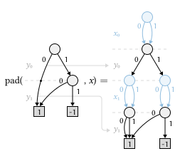

To compute the row-wise sum of the resulting matrix, we sum out the $y$ variables one at a time. Summing out a variable $y_i$ means merging its two edges: every node that branches on $y_i$ is replaced by the ADD-sum of the node its zero edge points to and the node its one edge points to. This addition is itself a pairwise operator, so it is computed with the Cartesian product and apply from the previous section.

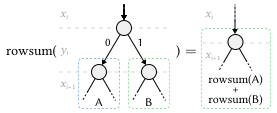

After all $n$ of the $y$ variables have been summed out, the ADD branches only on the $x$ variables, and its value at row $x = i$ is exactly $\sum_{j} a_{(i, j)} v_j$, the $i$-th entry of $Av$. Since the result is a vector, we finally rename each $x_i$ back to $y_i$ to recover the standard ADD representation of $Av$.

One optimization here: after padding the $x$ variables, we can skip the reducing step that would make the ADD reduced, as the Cartesian product is easier if the ADDs are "more layered" (i.e. fewer ply-skipping edges). And after the Cartesian product, reducing is still not necessary, as we will be summing out all the $y$ variables, which will reduce the ADD anyway.

## Quantum Computing and Algorithms

A fantastic video introduction to quantum computing from 3Blue1Brown can be found [here](https://www.youtube.com/watch?v=RQWpF2Gb-gU). I highly recommend watching it if you are new to quantum computing.

### Basics of quantum computing

Classical computing is about processing information represented by bits. We can store some data in a register, which is typically 32 or 64 bit wide, each bit can be either 0 or 1. There is no difference between what the register stores (the **state**) and what you can read from the register (the **measurement**). In quantum computing, we can still read from a register to get some bits of information, but most of the time, the outcome of the measurement is not deterministic. It follows a certain probability distribution, which is determined by the **quantum state** of the register. The quantum state is a mathematical object that describes the probabilities of measuring the register in different states. Each possible outcome in the quantum state is called a **basis state**.

We use the **bra-ket notation** to represent the basis states. For example, a 2-qbit quantum state has 4 basis states: $|00\rangle$, $|01\rangle$, $|10\rangle$, and $|11\rangle$; and a $n$-qbit quantum state has $2^n$ basis states. A quantum state can be represented as a linear combination of these basis states, where the coefficients, called **amplitudes**, are complex numbers. The square of the magnitude of an amplitude gives the probability of measuring the quantum state in the corresponding basis state.

For example, consider a 2-qbit quantum state:
$$
|\psi\rangle = \frac{1}{\sqrt{2}} |00\rangle - \frac{1}{2} |01\rangle + \frac{1}{2} |10\rangle
$$

It's amplitudes are $1/\sqrt{2}$, $-1/2$, $1/2$, and $0$ for the basis states $|00\rangle$, $|01\rangle$, $|10\rangle$, and $|11\rangle$ respectively. The probabilities of measuring the quantum state in these basis states are $1/2$, $1/4$, $1/4$, and $0$ respectively.

There is a strange property derived from the underlying quantum mechanics: once a quantum state is measured, it collapses to the basis state that was measured. This means that after measuring the quantum state $|\psi\rangle$ above, if we measure it and get $|00\rangle$, the quantum state will collapse to $|00\rangle$, and if we measure it again, we will always get $|00\rangle$. This property is called **quantum collapse**. Because of this property, for a quantum algorithm to be useful, we often design it to maximize the probability of measuring the desired basis state, and minimize the probability of measuring undesired basis states.

We can represent a quantum state as a vector of size $2^n$, where each entry corresponds to the amplitude of a basis state. For example, the quantum state $|\psi\rangle$ above can be represented as the following vector:

$$
|\psi\rangle = \left[
\frac{1}{\sqrt{2}},
-\frac{1}{2},
\frac{1}{2},
0
\right]^\top
$$

In classical computing, any algorithm can be seen as a transformation from the input state to the output state. The transformation can be composed of a series of basic operations, which are called logic gates. In quantum computing, we can also represent a quantum algorithm as a transformation from the input quantum state to the output quantum state. The transformation can be represented as a matrix, and it can be composed of a series of basic operations, which are called **quantum gates**.

### Quantum gates

Quantum gates are the building blocks of quantum algorithms. They are represented by **unitary** matrices, which are complex square matrices that preserve the length of vectors, thus preserving the property that the sum of the squares of the amplitudes is 1. As all gates are unitary matrices, all the gates are **linear, reversible** transformations to the quantum state. Linearity means that applying a quantum gate to a quantum state is equivalent to applying the gate to each basis state in the linear combination, and then summing the results. Reversibility means that for every quantum gate, there exists an inverse gate that can undo the transformation.

Quantum gates can be applied to one or more qbits, and they can be combined to form more complex quantum circuits.

#### Quantum circuit

Like classical logic circuits, quantum circuits are a model for quantum computation. A quantum circuit is a sequence of quantum gates applied to a set of qbits. The qbits are represented as horizontal lines, and the gates are represented as boxes or symbols placed on the lines. The order of the gates in the circuit corresponds to the order in which they are applied to the qbits.

After introducing each gate, I will show how to represent it in a quantum circuit diagram.

#### Hadamard gate

Hadamard gate is one of the most fundamental quantum gates. As mentioned earlier, the Hadamard gate is represented by the following matrix:
$$
H = \frac{1}{\sqrt{2}} H_2 = \frac{1}{\sqrt{2}} \begin{bmatrix}
1 & 1\\
1 & -1\\
\end{bmatrix}
$$

Let's take a look at how the Hadamard gate transforms a 1-qbit quantum state. Consider the following quantum states: $|0\rangle$, $|1\rangle$, $|+\rangle = (|0\rangle + |1\rangle)/\sqrt{2}$, $|-\rangle = (|0\rangle - |1\rangle)/\sqrt{2}$, After applying the Hadamard gate to these quantum states, we have:
$$
\begin{aligned}
H|0\rangle &= \frac1{\sqrt{2}}\begin{bmatrix}1 & 1\\1 & -1\end{bmatrix}\begin{bmatrix}1\\0\end{bmatrix} = \frac1{\sqrt{2}}\begin{bmatrix}1\\1\end{bmatrix} = |+\rangle\\
H|1\rangle &= \frac1{\sqrt{2}}\begin{bmatrix}1 & 1\\1 & -1\end{bmatrix}\begin{bmatrix}0\\1\end{bmatrix} = \frac1{\sqrt{2}}\begin{bmatrix}1\\-1\end{bmatrix} = |-\rangle\\
H|+\rangle &= \frac1{\sqrt{2}}\cdot\frac{1}{\sqrt{2}}\begin{bmatrix}1 & 1\\1 & -1\end{bmatrix}\begin{bmatrix}1\\1\end{bmatrix} = \begin{bmatrix}1\\0\end{bmatrix} = |0\rangle\\
H|-\rangle &= \frac1{\sqrt{2}}\cdot\frac{1}{\sqrt{2}}\begin{bmatrix}1 & 1\\1 & -1\end{bmatrix}\begin{bmatrix}1\\-1\end{bmatrix} = \begin{bmatrix}0\\1\end{bmatrix} = |1\rangle\\
\end{aligned}
$$

As we can see, the Hadamard gate transforms the basis states $|0\rangle$ and $|1\rangle$ into the superposition states $|+\rangle$ and $|-\rangle$, and vice versa. This property of the Hadamard gate is crucial in many quantum algorithms, as it allows us to create superpositions of quantum states, which is a key feature of quantum computing.

Hadamard gate can be seen as a reflection across $\theta = \pi/8$ in the Bloch sphere representation of a qbit. It is also a self-inverse gate, meaning that applying it twice returns the original state: $H^2 = I$, where $I$ is the identity matrix.

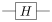

#### Identity gate

The identity gate is a quantum gate that does not change the state of the qbit it is applied to. It is represented by the identity matrix:
$$
I = \begin{bmatrix}
1 & 0\\
0 & 1\\
\end{bmatrix}
$$

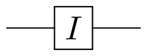

#### Not (Pauli-X) gate

The Not gate, also known as the Pauli-X gate, is a quantum gate that flips the state of a qbit. It is represented by the following matrix:

$$
X = \begin{bmatrix}
0 & 1\\
1 & 0\\
\end{bmatrix}
$$

Like classical logic gates, the not gate flips the state of a qbit from $|0\rangle$ to $|1\rangle$ and vice versa. It can be seen as a reflection across the $\theta = \pi/4$ axis in the Bloch sphere representation of a qbit. It is also a self-inverse gate.

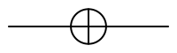

#### Controlled Not (CNOT) gate

The Controlled Not (CNOT) gate is a two-qbit quantum gate that flips the state of the second qbit (the target) if and only if the first qbit (the control) is in the state $|1\rangle$. It is represented by the following matrix:

$$
CNOT = \begin{bmatrix}
1 & 0 & 0 & 0\\
0 & 1 & 0 & 0\\
0 & 0 & 0 & 1\\ 
0 & 0 & 1 & 0\\
\end{bmatrix}
$$

Let's take a look at how the CNOT gate transforms a 2-qbit quantum state. Consider the following quantum states: $|00\rangle$, $|01\rangle$, $|10\rangle$, and $|11\rangle$. After applying the CNOT gate to these quantum states, we have:
$$
\begin{aligned}
CNOT|00\rangle &= \begin{bmatrix}1 & 0 & 0 & 0\\0 & 1 & 0 & 0\\0 & 0 & 0 & 1\\0 & 0 & 1 & 0\end{bmatrix}\begin{bmatrix}1\\0\\0\\0\end{bmatrix} = \begin{bmatrix}1\\0\\0\\0\end{bmatrix} = |00\rangle\\
CNOT|01\rangle &= \begin{bmatrix}1 & 0 & 0 & 0\\0 & 1 & 0 & 0\\0 & 0 & 0 & 1\\0 & 0 & 1 & 0\end{bmatrix}\begin{bmatrix}0\\1\\0\\0\end{bmatrix} = \begin{bmatrix}0\\1\\0\\0\end{bmatrix} = |01\rangle\\
CNOT|10\rangle &= \begin{bmatrix}1 & 0 & 0 & 0\\0 & 1 & 0 & 0\\0 & 0 & 0 & 1\\0 & 0 & 1 & 0\end{bmatrix}\begin{bmatrix}0\\0\\1\\0\end{bmatrix} = \begin{bmatrix}0\\0\\0\\1\end{bmatrix} = |11\rangle\\
CNOT|11\rangle &= \begin{bmatrix}1 & 0 & 0 & 0\\0 & 1 & 0 & 0\\0 & 0 & 0 & 1\\0 & 0 & 1 & 0\end{bmatrix}\begin{bmatrix}0\\0\\0\\1\end{bmatrix} = \begin{bmatrix}0\\0\\1\\0\end{bmatrix} = |10\rangle\\
\end{aligned}
$$

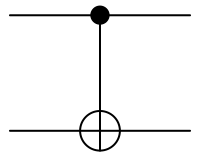

#### Toffoli (CCNOT) gate

The Toffoli gate, also known as the Controlled-Controlled Not (CCNOT) gate, is a three-qbit quantum gate that flips the state of the third qbit (the target) if and only if the first two qbits (the controls) are both in the state $|1\rangle$. It is represented by the following matrix:

$$
CCNOT = \begin{bmatrix}
1 & 0 & 0 & 0 & 0 & 0 & 0 & 0\\
0 & 1 & 0 & 0 & 0 & 0 & 0 & 0\\
0 & 0 & 1 & 0 & 0 & 0 & 0 & 0\\
0 & 0 & 0 & 1 & 0 & 0 & 0 & 0\\
0 & 0 & 0 & 0 & 1 & 0 & 0 & 0\\
0 & 0 & 0 & 0 & 0 & 1 & 0 & 0\\
0 & 0 & 0 & 0 & 0 & 0 & 0 & 1\\
0 & 0 & 0 & 0 & 0 & 0 & 1 & 0\\
\end{bmatrix}
$$

We can use a truth table to understand how the Toffoli gate transforms a 3-qbit quantum state. The truth table for the Toffoli gate is as follows:

| I1 | I2 | I3 | O1 | O2 | O3 |
|---------|---------|---------|----------|----------|----------|
|    0    |    0    |    0    |     0    |     0    |     0    |
|    0    |    0    |    1    |     0    |     0    |     1    |
|    0    |    1    |    0    |     0    |     1    |     0    |
|    0    |    1    |    1    |     0    |     1    |     1    |
|    1    |    0    |    0    |     1    |     0    |     0    |
|    1    |    0    |    1    |     1    |     0    |     1    |
|    1    |    1    |    0    |     1    |     1    |     1    |
|    1    |    1    |    1    |     1    |     1    |     0    |

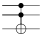

Toffoli gate is particularly useful, because itself is a universal gate for classical computing, meaning that any classical logic circuit can be constructed using only Toffoli gates. The following diagram shows how to construct a classical NAND gate using a Toffoli gate:

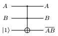

As NAND gate is a universal gate for classical computing, we can use Toffoli gates to construct any classical logic circuit. Therefore, quantum circuits can **simulate any algorithms in classical computing**.

### Composing a quantum circuit

Quantum circuits can be composed of multiple quantum gates applied in sequence / parallel. For a n-qbit quantum circuit, we draw $n$ horizontal lines in the diagram, each representing a qbit. The gates are drawn as boxes or symbols on the lines, and the order of the gates corresponds to the order in which they are applied to the qbits.

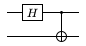

The above quantum circuit diagram shows a simple quantum circuit with 2 qbits. We first apply a Hadamard gate to the first qbit, then apply a CNOT gate with the first qbit as the control and the second qbit as the target. So how do we represent this quantum circuit as a matrix?

#### Parallel composition of quantum gates

For a n-qbit quantum circuit, if we want to apply a quantum circuit $G$ to the $0\sim i - 1$th qbit, and quantum circuit $H$ to the $j \sim n - 1$th qbit, we can represent the parallel composition of these two circuits as a Kronecker product of the two circuits: $G \otimes H$. For example, for the above quantum circuit, the first step is to apply a Hadamard gate to the first qbit. Since the second qbit should wait for the application of Hadamard gate to the first qbit, we have to use the identity gate to fill in the second qbit, making the first operation valid for a 2-qbit quantum circuit. Therefore, we can represent the first operation as a Kronecker product of the Hadamard gate and the identity gate: $H \otimes I$:

$$
O_1 = H \otimes I = \frac{1}{\sqrt{2}}
\begin{bmatrix}
1 & 1\\
1 & -1
\end{bmatrix} \otimes \begin{bmatrix}
1 & 0\\
0 & 1
\end{bmatrix} = \frac{1}{\sqrt{2}}
\begin{bmatrix}
1 & 0 & 1 & 0\\
0 & 1 & 0 & 1\\
1 & 0 & -1 & 0\\
0 & 1 & 0 & -1
\end{bmatrix}
$$

We can also use Kronecker product to represent the concatenation of two qbits. For example, if we have two qbits in the state $|+\rangle$ and $|0\rangle$, they form a 2-qbit quantum state $|+\rangle \otimes |0\rangle$, which can be represented as a Kronecker product of the two qbits:
$$
|+\rangle \otimes |0\rangle = \frac{1}{\sqrt{2}} \begin{bmatrix}1\\1\end{bmatrix} \otimes \begin{bmatrix}1\\0\end{bmatrix} = \frac{1}{\sqrt{2}} \begin{bmatrix}1\\0\\1\\0\end{bmatrix} = \frac{1}{\sqrt{2}}(|00\rangle + |10\rangle)
$$

We can verify the correctness of the above matrix by applying it to the 2-qbit basis states $|00\rangle$, $|01\rangle$, $|10\rangle$, and $|11\rangle$:

$$
\begin{aligned}
O_1|00\rangle &= \frac{1}{\sqrt{2}}
\begin{bmatrix}
1 & 0 & 1 & 0\\
0 & 1 & 0 & 1\\
1 & 0 & -1 & 0\\
0 & 1 & 0 & -1
\end{bmatrix} \begin{bmatrix}1\\0\\0\\0\end{bmatrix} = \frac{1}{\sqrt{2}} \begin{bmatrix}1\\0\\1\\0\end{bmatrix} = \frac{1}{\sqrt{2}}(|00\rangle + |10\rangle) = |+\rangle \otimes |0\rangle\\
O_1|01\rangle &= \frac{1}{\sqrt{2}} \begin{bmatrix}1 & 0 & 1 & 0\\0 & 1 & 0 & 1\\1 & 0 & -1 & 0\\0 & 1 & 0 & -1\end{bmatrix} \begin{bmatrix}0\\1\\0\\0\end{bmatrix} = \frac{1}{\sqrt{2}} \begin{bmatrix}0\\1\\0\\1\end{bmatrix} = \frac{1}{\sqrt{2}}(|01\rangle + |11\rangle) = |+\rangle \otimes |1\rangle\\
O_1|10\rangle &= \frac{1}{\sqrt{2}} \begin{bmatrix}1 & 0 & 1 & 0\\0 & 1 & 0 & 1\\1 & 0 & -1 & 0\\0 & 1 & 0 & -1\end{bmatrix} \begin{bmatrix}0\\0\\1\\0\end{bmatrix} = \frac{1}{\sqrt{2}} \begin{bmatrix}1\\0\\-1\\0\end{bmatrix} = \frac{1}{\sqrt{2}}(|00\rangle - |10\rangle) = |-\rangle \otimes |0\rangle\\
O_1|11\rangle &= \frac{1}{\sqrt{2}} \begin{bmatrix}1 & 0 & 1 & 0\\0 & 1 & 0 & 1\\1 & 0 & -1 & 0\\0 & 1 & 0 & -1\end{bmatrix} \begin{bmatrix}0\\0\\0\\1\end{bmatrix} = \frac{1}{\sqrt{2}} \begin{bmatrix}0\\1\\0\\-1\end{bmatrix} = \frac{1}{\sqrt{2}}(|01\rangle - |11\rangle) = |-\rangle \otimes |1\rangle

\end{aligned}
$$

#### Serial composition of quantum gates

For a n-qbit quantum circuit, if we want to apply a quantum circuit $G$ first, and then apply a quantum circuit $H$, just like intuition, we can represent the serial composition of these two circuits as a matrix multiplication of the two circuits: $H \cdot G$. For example, for the above quantum circuit, the second step is to apply a CNOT gate with the first qbit as the control and the second qbit as the target. Therefore, we can represent the second operation as a matrix multiplication of the CNOT gate and the result of the first operation: $CNOT \cdot O_1$:

$$
CNOT \cdot O_1 = \begin{bmatrix}
1 & 0 & 0 & 0\\
0 & 1 & 0 & 0\\
0 & 0 & 0 & 1\\ 
0 & 0 & 1 & 0\\
\end{bmatrix} \cdot \frac{1}{\sqrt{2}} \begin{bmatrix}
1 & 0 & 1 & 0\\
0 & 1 & 0 & 1\\
1 & 0 & -1 & 0\\
0 & 1 & 0 & -1
\end{bmatrix} = \frac{1}{\sqrt{2}} \begin{bmatrix}
1 & 0 & 1 & 0\\
0 & 1 & 0 & 1\\
0 & 1 & 0 & -1\\ 
1 & 0 & -1 & 0\\
\end{bmatrix}
$$

### Grover's algorithm

Grover's algorithm is a quantum algorithm that can search an unsorted database of $N$ items in $O(\sqrt{N})$ time, which is a quadratic speedup over classical algorithms that require $O(N)$ time. The algorithm was developed by Lov Grover in 1996 and is one of the most well-known quantum algorithms.

To apply Grover's algorithm, we need to map all the items in the database to a set of basis states of a quantum system. For example, if we have a database of 4 items, we can map them to the basis states $|00\rangle$, $|01\rangle$, $|10\rangle$, and $|11\rangle$. Then, we translate the search problem into a quantum oracle, which is a black-box function that can recognize the desired item. The oracle is represented as a unitary matrix $U_\omega$ that **flips the sign of the amplitude** of the basis state corresponding to the desired item, while leaving the amplitudes of all other basis states unchanged.

The oracle function is possible because we have proven that any classical logic circuit can be constructed using only Toffoli gates. Therefore, we can construct a quantum circuit that output 1 if the input is the desired item, and output 0 otherwise. Then, we can use a **controlled not (CNOT)** gate to negate an [**ancilla**](https://en.wikipedia.org/wiki/Ancilla_bit) qbit $y$. Let $U_f$ denote the (n + 1)-qbit circuit that negates the ancilla qbit $y$ if the input $x$ is the desired item $\omega$, and outputs 0 otherwise:

$$
U_f(|x\rangle\otimes|y\rangle) = \begin{cases}
|x\rangle\otimes|\neg y\rangle & \text{if } x = \omega \\
|x\rangle\otimes|y\rangle & \text{if } x \neq \omega
\end{cases}
$$
or:
$$
U_f|x\rangle\otimes|y\rangle = |x\rangle\otimes|y \oplus f(x)\rangle
$$

Now we can construct the oracle function $U_\omega$ that flips the sign of the amplitude of the basis state corresponding to the desired item $\omega$:

$$
\begin{aligned}
U_f(|x\rangle\otimes|-\rangle) &= \frac{1}{\sqrt{2}} U_f(|x\rangle\otimes|0\rangle - |x\rangle\otimes|1\rangle)\\
&= \frac{1}{\sqrt{2}} (|x\rangle\otimes|0\oplus f(x)\rangle - |x\rangle\otimes|1\oplus f(x)\rangle)\\
&= \begin{cases}
\frac{1}{\sqrt{2}} (|x\rangle\otimes|1\rangle - |x\rangle\otimes|0\rangle) = -|x\rangle\otimes|-\rangle & \text{if } x = \omega\\
\frac{1}{\sqrt{2}} (|x\rangle\otimes|0\rangle - |x\rangle\otimes|1\rangle) = |x\rangle\otimes|-\rangle & \text{if } x \neq \omega\\
\end{cases}\\
&=(U_\omega|x\rangle)\otimes|-\rangle
\end{aligned}
$$

The Grover's algorithm goes as follows:

1. Initialize the quantum state to $|0^n\rangle = |0\rangle^{\otimes n}$.
2. Apply Hadamard gate to each qbit to create a superposition of all basis states:
    $$
    H^{\otimes n}|0^n\rangle = \frac{1}{\sqrt{2^n}} \sum_{x=0}^{2^n-1} |x\rangle
    $$
    We denote this state as $|s\rangle = 1/\sqrt{2^n} \sum_{x=0}^{2^n-1} |x\rangle$.
3. Repeat the following steps $\pi\sqrt{N}/4$ times:
    1. Apply the oracle function $U_\omega$ to flip the sign of the amplitude of the desired item $\omega$.
    2. Apply the **Grover diffusion operator** $U_s = 2|s\rangle\langle s| - I$, where $\langle s|$, or the "bra" of $|s\rangle$, is the conjugate transpose of $|s\rangle$. 

The Grover diffusion operator is a reflection across the state $|s\rangle$ in the Hilbert space. It amplifies the amplitude of the desired item $\omega$ while reducing the amplitudes of all other items. It can be also represented as:

$$
\begin{aligned}
U_s &= 2|s\rangle\langle s| - I\\
&= 2(H^{\otimes n}|0^n\rangle\langle 0^n|H^{\otimes n}) - I\\
&= 2(H^{\otimes n}|0^n\rangle\langle 0^n|H^{\otimes n}) - H^{\otimes n}H^{\otimes n}\\
&= H^{\otimes n}(2|0^n\rangle\langle 0^n|H^{\otimes n} - H^{\otimes n})\\
&= H^{\otimes n}(2|0^n\rangle\langle 0^n| - I)H^{\otimes n}
\end{aligned}
$$

which is the representation in the figure above: first apply Hadamard gate to each qbit, then apply a conditional phase shift that flips the sign of the amplitude of the all basis states except $|0^n\rangle$, and finally apply Hadamard gate to each qbit again. The matrix form of $2|0^n\rangle\langle 0^n| - I$ is:

$$
2|0^n\rangle\langle 0^n| - I = \begin{bmatrix}
1 & 0 & \cdots & 0\\
0 & -1 & \cdots & 0\\
\vdots & \vdots & \ddots & \vdots\\
0 & 0 & \cdots & -1\\
\end{bmatrix}
$$

The idea behind Grover's algorithm is quite fascinating. By this two steps, we move the quantum state vector closer to the basis state corresponding to the desired item $\omega$ in the Hilbert space. I strongly recommend watching the 3Blue1Brown's video to understand the geometric interpretation of Grover's algorithm: [Grover's algorithm explained geometrically](https://www.youtube.com/watch?v=RQWpF2Gb-gU).

