---
title = "はこだて　函館"
created = 2025-03-03
lang = "zh-Hans"
tags = ["travel", "photography"]
---

> Camera: Sony α7c II + Sony 35mm f/1.8

## 杂记（1）

日本有意思的城市很多。有别于中国和其他东亚国家的大街区之间穿行的弄堂，有别于欧洲的网状密布，亦有别于北美之千篇一律的密集格子，日本的城市汇聚了此三者之间的神韵：有北美之规范而不乏跳脱，有东亚之写意而无惧随性，有欧洲之自由又蕴含稍稍的刻板。

在早前看攻略时看到，江户时期日本受中国儒家和封建制度的影响，分为士农工商四个阶级。"士"即武士。那时的江户城内，最低贱的"商"阶级居住在皇城以东的丸之内、银座一地，只得分得最小的住宅，最窄的街道；形成了密集狭窄的格子城。士、农、工则分到了更加广阔的上野、池袋、文京、新宿、涩谷；道路依山而建，更加讲究自然景观。跟如今，银座一带依旧是"商"聚集的地方，不过"商"在资本主义世界摇身一变，同银座一样，成为东京奢华之名片。格子城的形状和大小和纽约颇为神似；而纽约中城上城的格子比江户城那些晚了不知道多少年；不知是不是那些古时的"商"有极为突出的先见之明。

## ゆき　雪

在东京站坐新干线到函馆。东京都区将此刻的世界分为两个部分：区内看得见富士山而看不见雪；区外看得见雪而看不见富士山。此刻没有一点云覆盖在富士山的山顶上，但已是望向她的最后一眼。

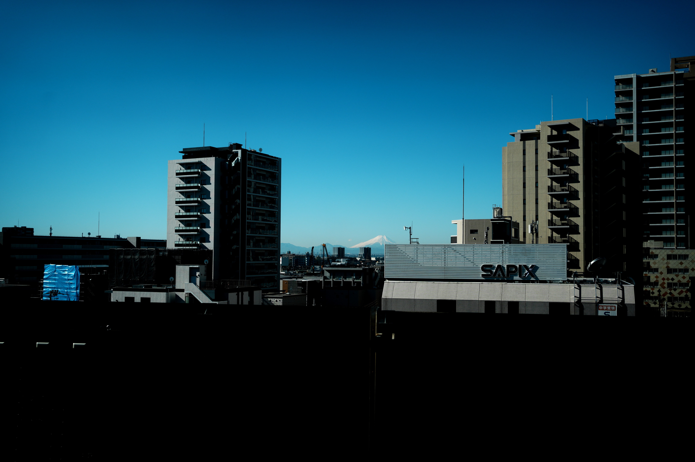

过了某一隧道后，除了隼号列车带来的习以为常的耳膜不适，云突然就遮蔽了整个天空。一低头，雪便在每一处屋顶停留。

在路上拍了很多视频，照片并未留存许多；之后有空把博客的视频功能加上。

行经青森。这里的雪是一路上最厚的。(Shot on iPhone)

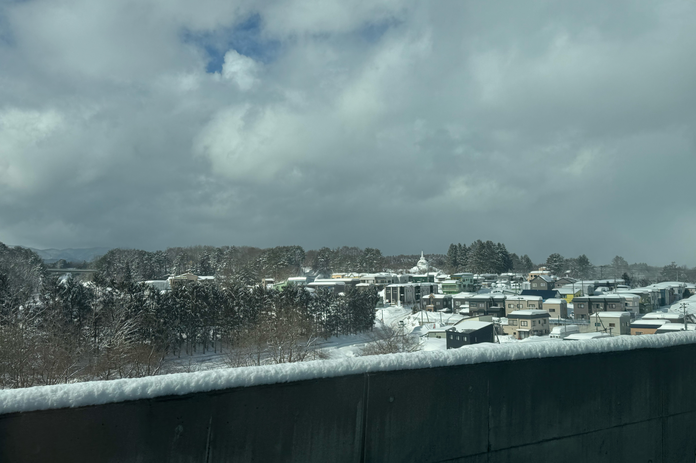

新干线只停在新函馆北斗，仍需做在来线（仅需30分钟）到达函馆站。一出站台就感觉不对劲。

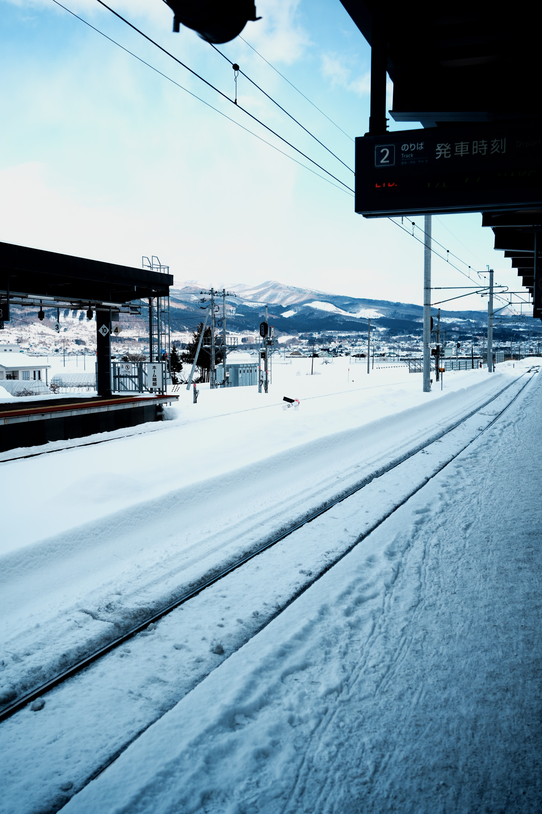

在遮雨棚下的地面依旧被雪覆盖得厚厚实实的，被人踩结成冰，其上是薄薄的一层刚下的粉雪，未经踩实，略微起到一些防滑的作用；但其覆盖极其不均，不留意就会踩到一块完整的、厚实的冰面上；若未把握好重心，便会踉跄一下，心中涌起少许的失重感。

Spoiler alert：整趟行程（包括在札幌）虽然一次也没摔倒过，但此情此景已经成为每个在北海道即将睡着前时刻必有的惊吓：我会立马从椅子或床上手脚伸直想保持平衡，然后一阵时就没法睡着了。

这种感觉如同在麦迪逊似曾相识，却有着说不上来的分别。函馆的温度比零下20度的麦迪逊高很多，以至于刚来这里时觉得棉毛衫、冲锋衣甚至是多余的（不过呆久了一样还是觉得冷）。记得那里如沙丘般风化的雪堆、刺骨的风刮起的雪雾、眼镜上结上的冰，不过两年多以后，却已经忘记那时踩在雪地里的感觉。为弥补遗憾，我走到哪都录了一段在雪上走的视频，后来演变为比较哪个地方积雪更厚。

又如同广州的雨，函馆的雪会来得很突然。在酒店房间里时天上还未出现任何一朵云，一下电梯外面突然降下暴雪。

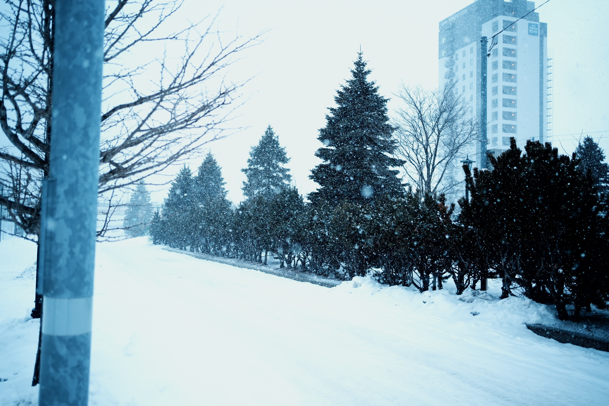

函馆的暴雪通常伴随着大 风。风吹落屋檐上的积雪，就形成一片雪雾，镜头中便是白茫茫一片。

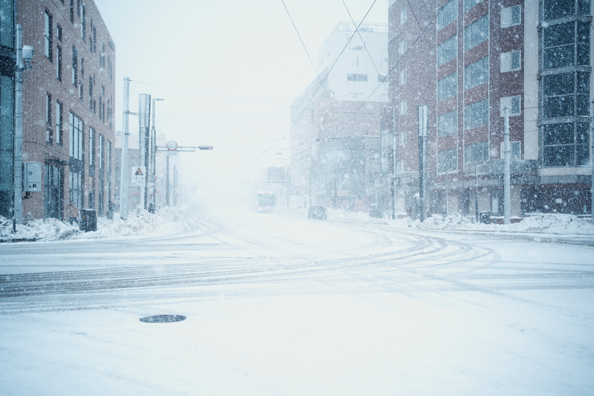

在风口中的树，树冠上的雪通常已被吹走；仅有树干面对风的地方，垂直地积有风带来的雪。从未在任何地方见过。

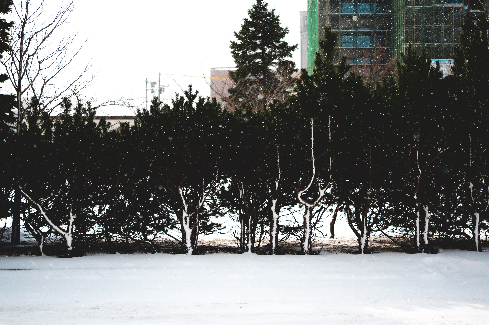

北海道的粉雪的是特别的，而函馆初下的雪是其中最为特殊的一种。它如同此处吹起的海风，沾粘在相机、手套和绒线帽上。你若想把它揉成雪球，它表面上会服服帖帖地随着你的手聚拢成一团；而你在把它按实的时候，它就会不服气地散为几块。你于是心中稍有些恼火又有些欣慰，把它继续揉搓为细碎的雪粒撒向空中。风又将其化作雪雾，同屋檐上刮落的那些一道，吹回你挖起它的地方。

想打雪仗也可以。这里的雪是最不具攻击性的，除了在衣服上留下一道白色的痕迹。但堆雪人的话，至少是我，却连个10cm直径的雪球也滚不起来。

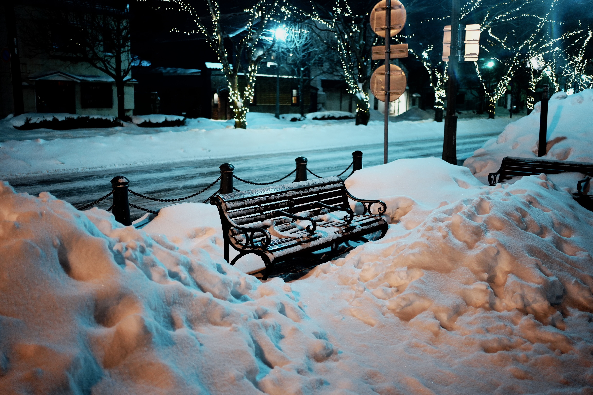

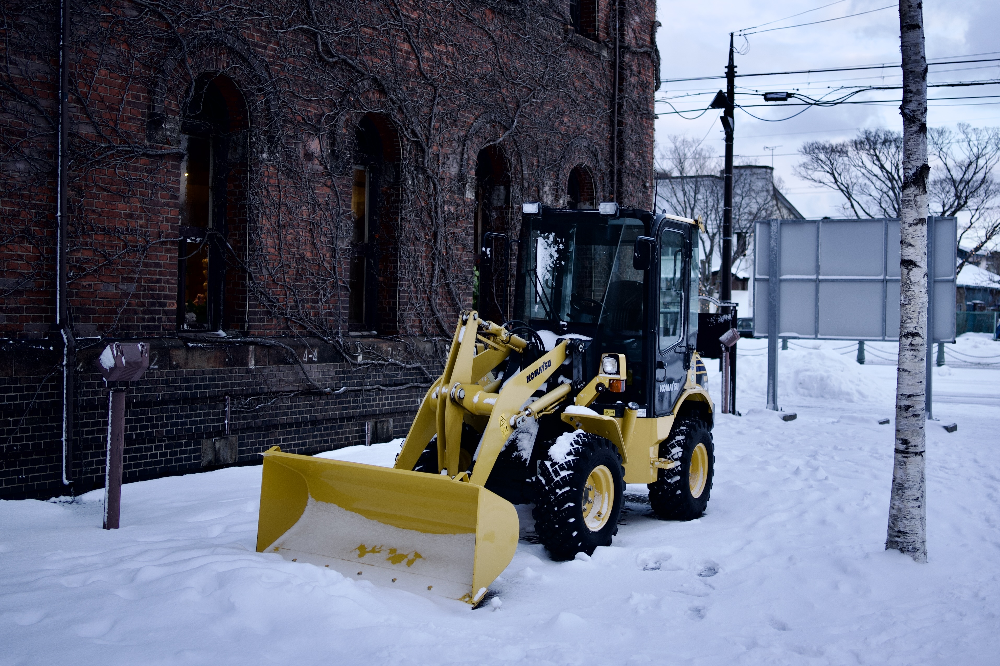

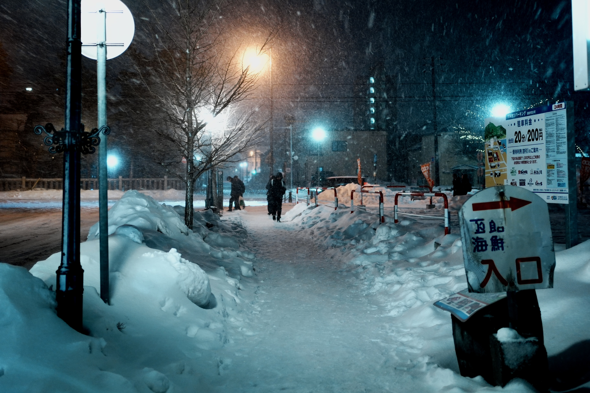

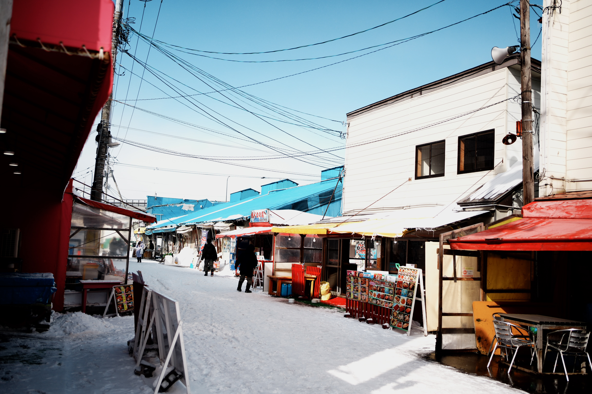

函馆早市。

晚上在Century Marina Hakodate酒店去泡了温泉，雪很小，不过还在下着。酒店里的温泉在顶楼，并不大：除了一片在室内的温泉外，还有一大片露天的地方。我想着再好好享受这里的夜景，便去了露天的汤池。日本泡温泉需要全裸，温度已经在零下，刚走出去的时候巨冷无比，遂赶紧钻进汤池里。外面只有我一个人，躺在里面，雪落在浸湿的头发上烊开，身上温泉水泡的很热，一摸头发却是快要结冰的感觉，自己又毫无感觉，又赶紧在温泉水里浸一浸恢复温度。循环了几次，也不知泡了多久，起来光着身子在零下的下雪天站着也一点都不冷了。特别神奇。

## やまとうみ　山海

觉得这里和麦迪逊很像：冷、雪、45度东北西南走向的地峡（实际上函馆仅是在函馆山岛和大陆间堆积的沙洲）、20多万的人口，小城市、城市限高、海鸥、好吃的牛奶和冰激凌、遍地的酒吧（如果居酒屋算的话），甚至函馆港都像麦迪逊的Picnic Point。若要用一个词形容两座城市的区别：麦迪逊就是"湖"：环抱的Mendota、Monona湖，冬日冻结的湖面和冬捕、湖面上的鸭子；而函馆则是"山海"：函馆山、津轻海峡和函馆湾，不冻港、海风和叫声像人一样的乌鸦。

### 之一　海

与函馆西北方向函馆港刺骨凛冽的风不同，从函馆站前的主街一直往东南走，面朝函馆湾那一侧是温柔而亲和的沙滩。

路途并不算短。路上有一个卖冰激凌的老爷爷，讲着标准的英式英语。在日本可以听到毫无口音的英语属实特别难得。经过了一些百货商店、居酒屋和神社，在看到海的那一刻，此行就有了目的地。

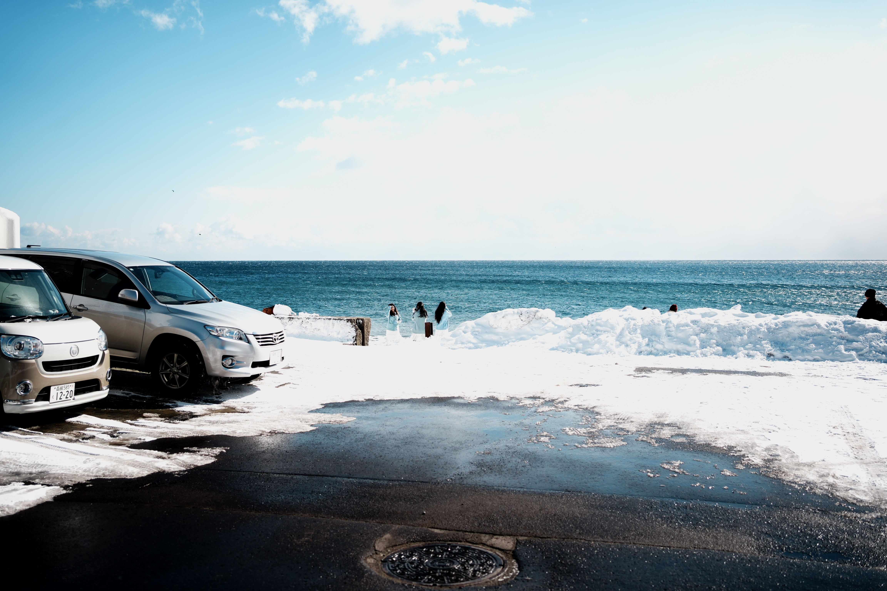

雪依旧积得很厚，在靠近海的时刻，积雪就被脚印和海浪雕刻得细碎。

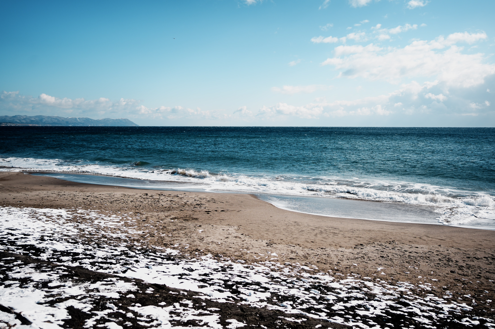

沙滩靠近内侧的沙子是黑色的，却一点也不脏。阳光下，那些沙子会闪烁着细细亮光；新下的雪和沙子一样，不过略有磨砂的质感；而积起一阵的雪汇聚成了稍大一些的冰晶，闪烁着的光就没有那么细。

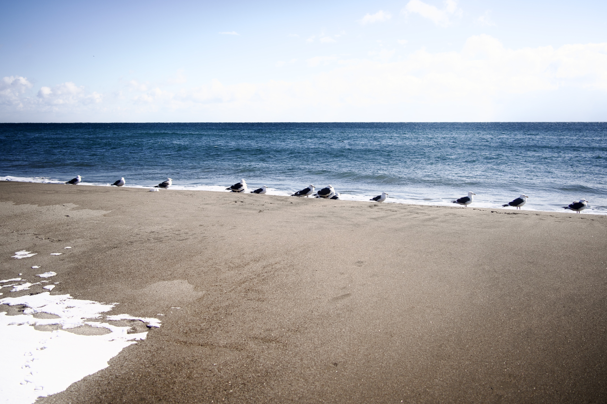

海鸥。雪上只留有海鸥的脚印。

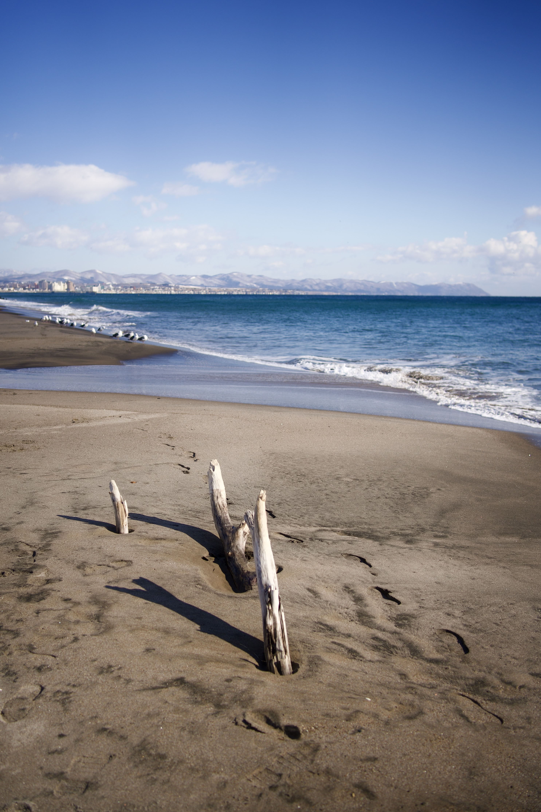

一些枯枝，脚印，海鸥。

沿着海边走。感觉此处并不是目的地，仅仅是旅途的第一站。

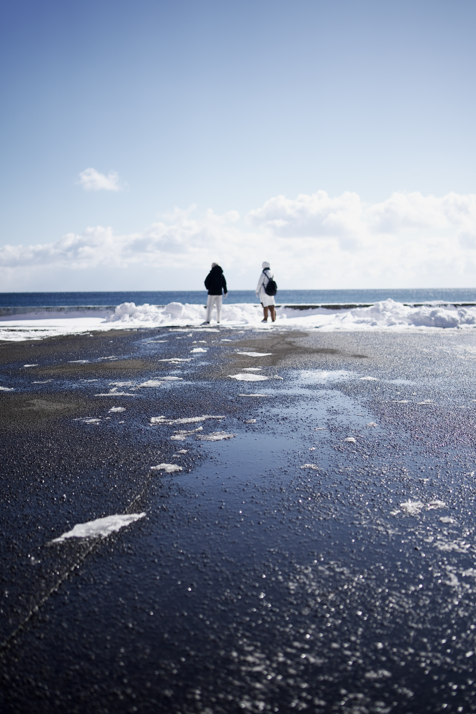

地上的雪好像在模仿着天上的云，或者反之。

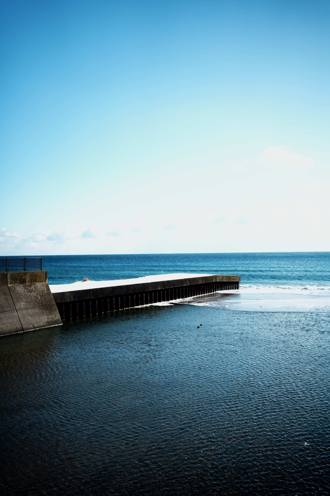

沿着海边走，走入了一处无人出入的停车场。地上的雪几乎未经触动，还很厚，想都不用想都知道我要干什么——躺雪地里。（Shot on iPhone by friends)

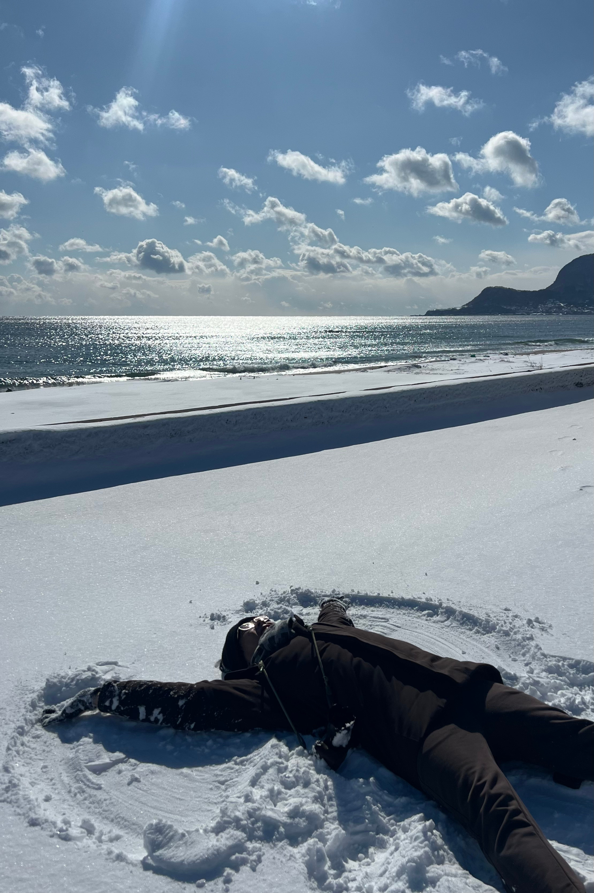

不过躺在雪地上得记住三件事：

1. 带墨镜。
2. 相机在雪地里粘的雪一定要擦掉，或者不要把相机放在雪地上。
3. 检查身上白色的东西有没有掉在雪地上。

对于第二点，见以下两张照片上中间偏左上的亮斑。

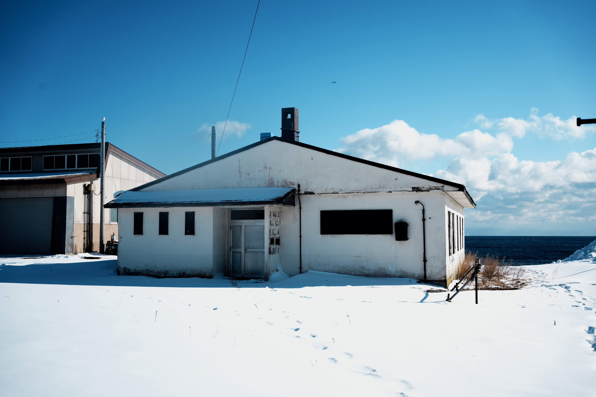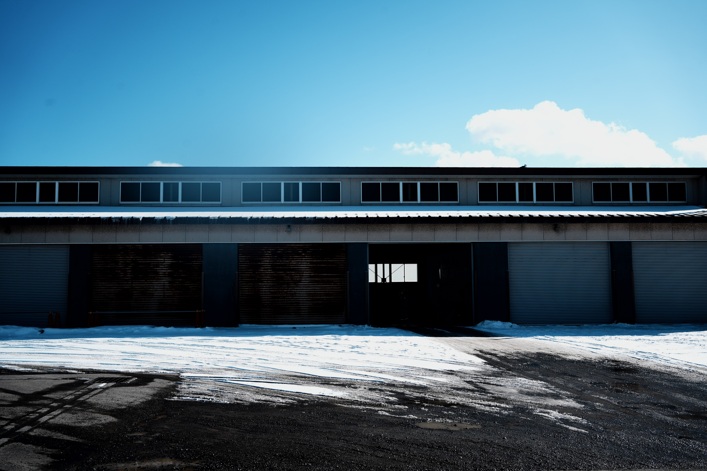

对于第三点，见这张隔了一个小时，尝试让不懂英文的出租车司机理解如何绕了路并回来才拍的照片：（幸亏AirPods Pro第二代丢失的时候可以发声了，库克的恩情还不完😭）

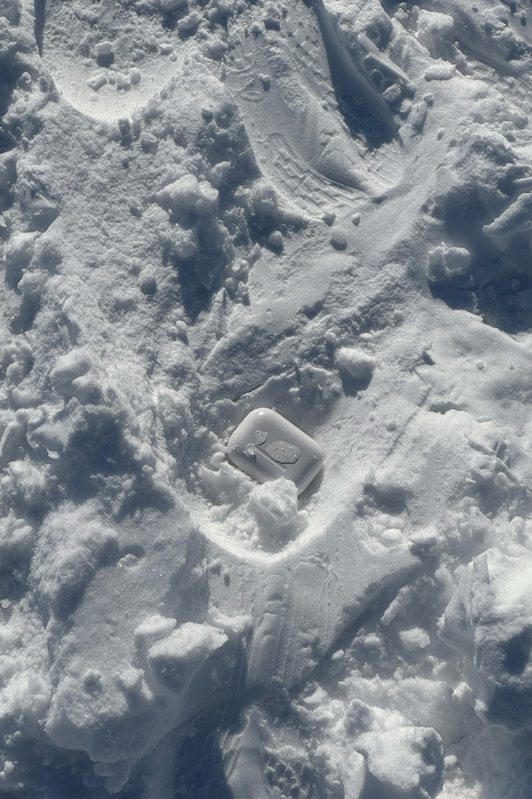

不过总的来说，值得一试；或说若未曾躺过此处的雪，我也许并不会如此爱这个地方。

正好此时存储卡拍完了，才导致没有出更多的废片。

### 之二　山

函馆山只有334米，只比家乡的虞山和香山高出几许，但其好处就在于其山脚下就是市中心。

不必像那时坐飞机从纽约回麦迪逊，从窗外看去才第一次被湖光与城市交映的麦迪逊天际线而感动；也不必像东京或者纽约那样的大城市那样，建数座观景台，望见令人迷惘的钢铁森林和一望无际的人造建筑；函馆山就在那里，不高不矮，不近不远，将山、海与这座安静的城市裱入同一个画框。（p.s. 补一张飞机舷窗里的麦迪逊。我乘坐的这架Delta的CRJ-900飞机，注册号N932XJ，于2025年2月17日在多伦多着陆时倾覆坠毁，所幸机上全数人员全部生还。以此纪念。）

4点20分，随缆车登山。随着缆车的缓缓升高，逐渐得以俯瞰这个城市的全貌。函馆山的阴影已经覆盖住城市西南的一半；阴影中的一半里，白色的雪覆盖着五彩的建筑物；而夕阳中的一半，一切都是是金黄色的。我举起手机，从左至右拍摄起函馆的全景；恰巧，对向而行的缆车从画面穿行而过，穿过脚下的雪松。

到达山顶后，旁边的人和我和我用英语说想要我在缆车里拍的视频。我认出他们好像是华人，然后就说了一声 "中文"？他们很惊讶地和我说，原来你是中国人啊！你长得特别日系。

原来日本人见到我全说日语是有原因的。

函馆山顶人特别多。这里据说是世界三大夜景之一，所有人都在等着蓝调时刻城市亮起灯火。

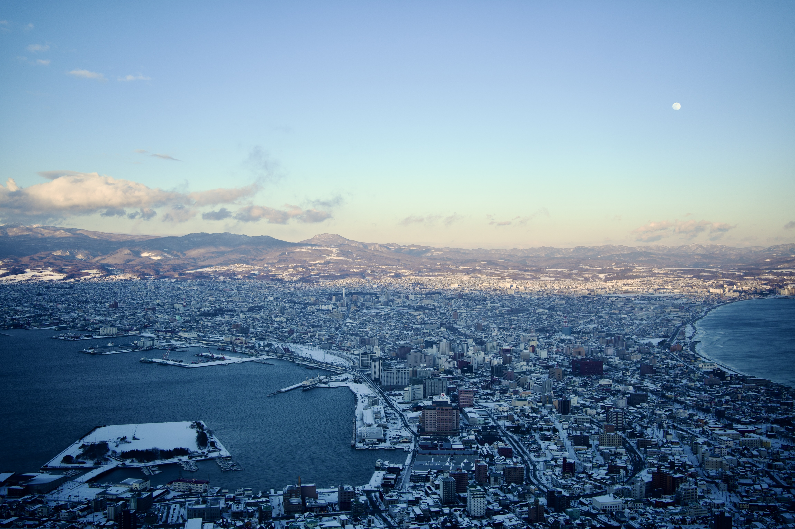

今日刚好是满月。

待城市的每一个角落都无法看到太阳时，观景台上的人就开始围起几层来。

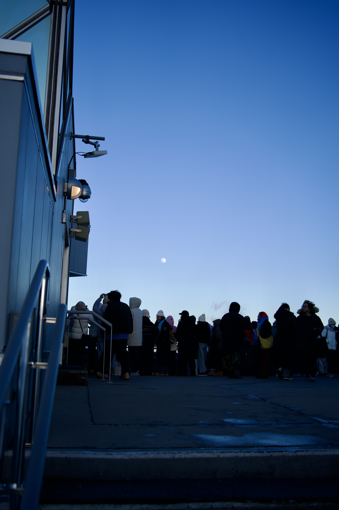

我随便找了一个位置。位置还算靠前；在我前面的两人好像是本地的一对老夫妻，还在用这很老的手机和卡片相机；在我后面的是几个中国的大学生，人手一台相机，还在交流着相机参数怎么调比较好。他们说，ISO调到25600，快门1/4000秒，然后跳起来就可以拍到全景。

天开始变暗，城市里开始现出少许灯光；随后是路灯。海水开始呈现深邃的蓝，再转为黑色。再之后，地上的积雪开始有了灯火的颜色。

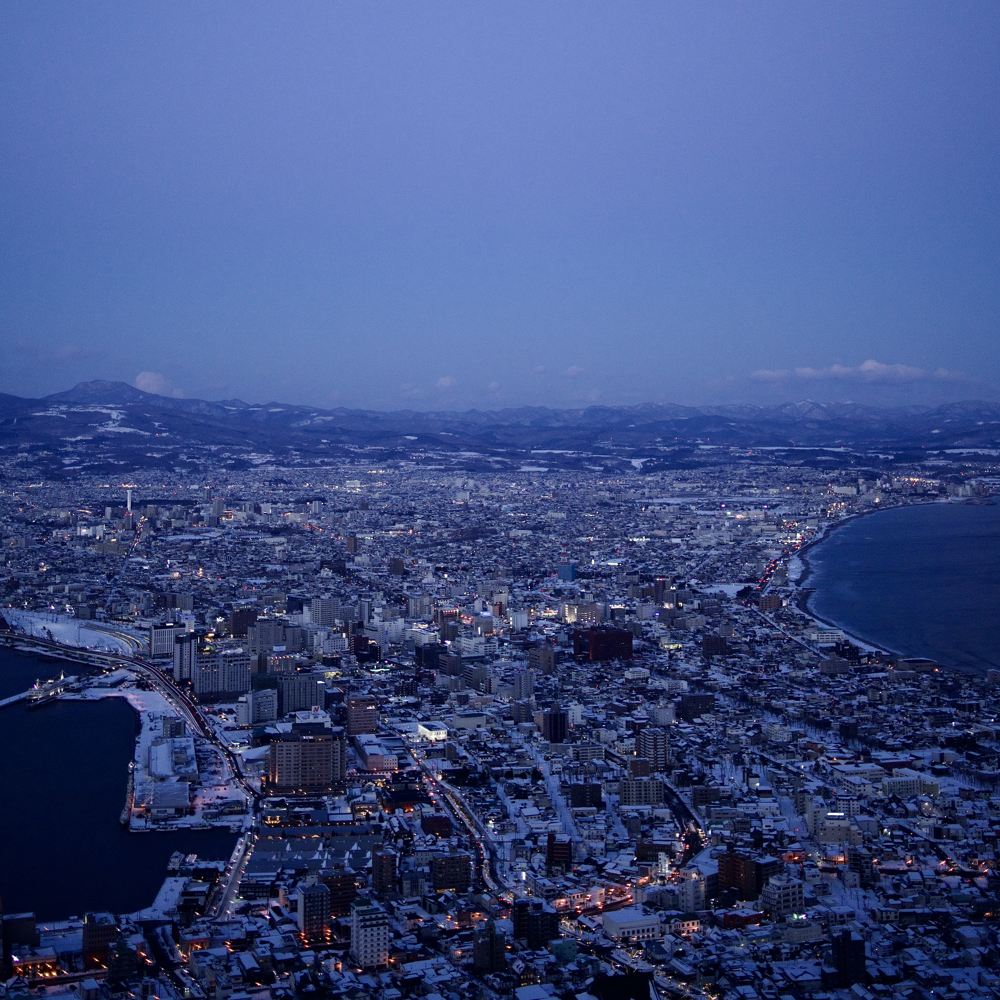

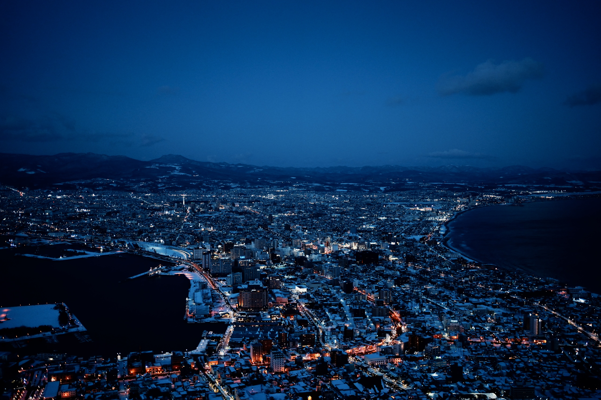

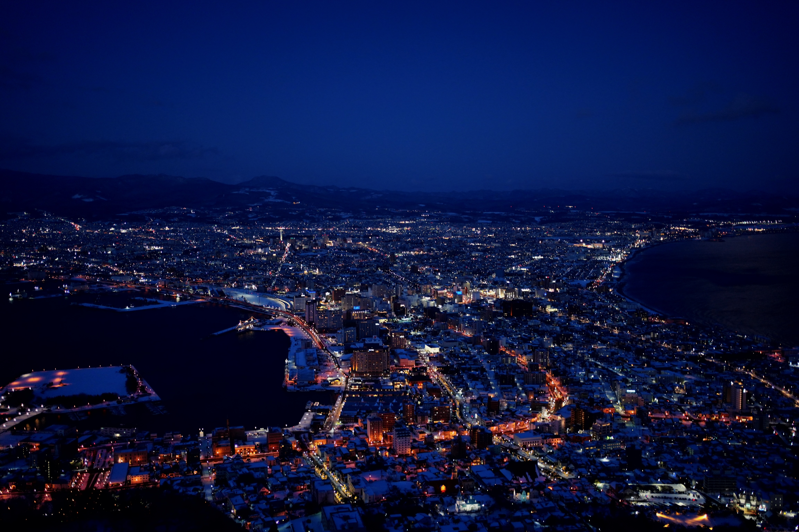

随后，随着彻底进入黑夜，人逐渐散去，便只剩下城市灯火。高感的质感还算不错。

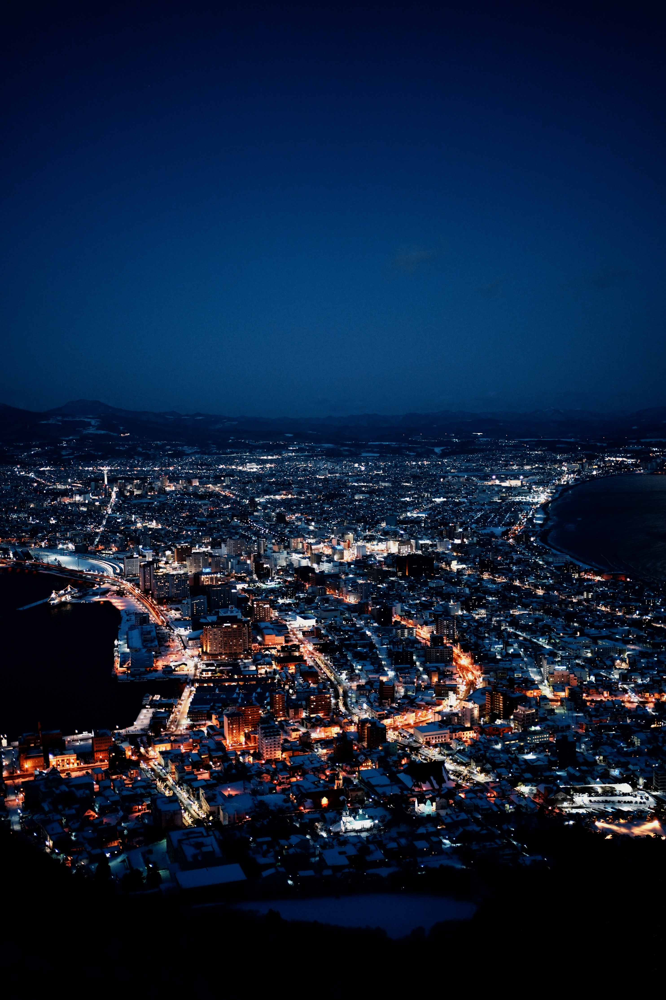

函馆的路网不像东京的新宿和银座一般因阶级而产生区分。它只知道，山在这里，海在哪里。随着山的梯度、随着海的弧度，无所谓东西南北。

## 杂记（2）

函館的日语是はこだて (Hakodate)。第一次知道这个地方还是在买JR指定席票的时候：我知道东京是Tōkyo，成田是Narita，羽田是Henada，札幌是Sapporo；几站里唯一不知道英语的则是函馆Hakodate。但如今，有关此地的记忆似乎于はこだて这个可爱的发音更加契合。

住进酒店的第一天晚上就遇到了地震。一搜，4.8级，震中离我大概只有十公里。

从札幌回东京那一天，又从函馆经过。离新干线发车时间尚早，于是从新函馆北斗转身回到函馆市内。不过，函馆已经不再下雪，几天的阳光、雨和车轮带走了独属于那时函馆的纯洁。也罢，新的雪总会在不久的将来会到这座城市。

函馆的人才不管雪落雪融。新函馆北斗站旁，大概是一个仅有几百人的小村庄。站前广场上，他们搭起帐篷，办一个嘉年华。几个工作人员在给小朋友转转盘，欢声笑语随着我走进回到东京的新干线列车。

（完）
