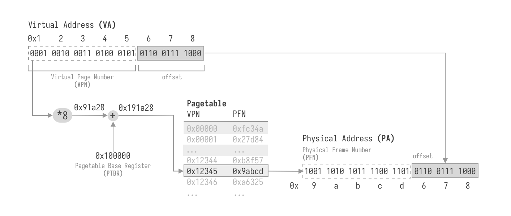
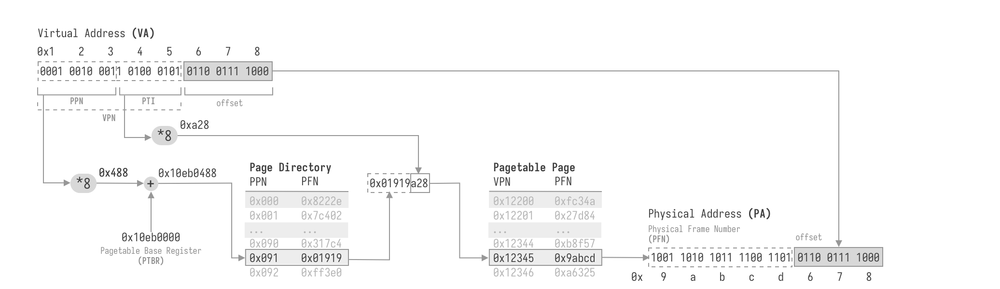
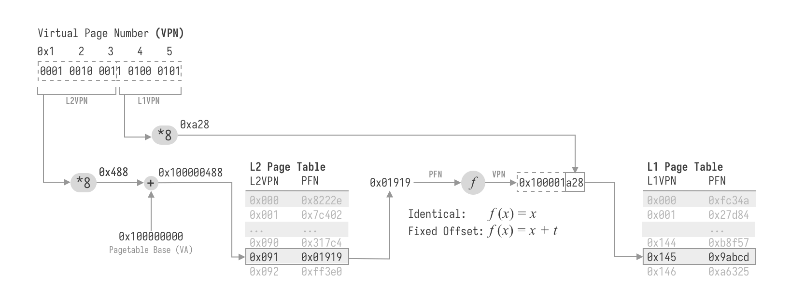
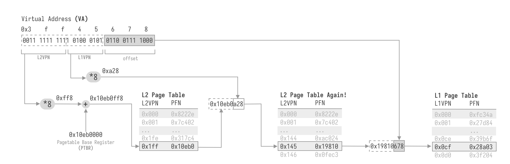
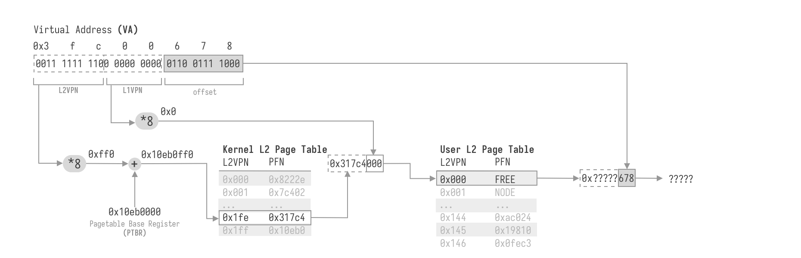
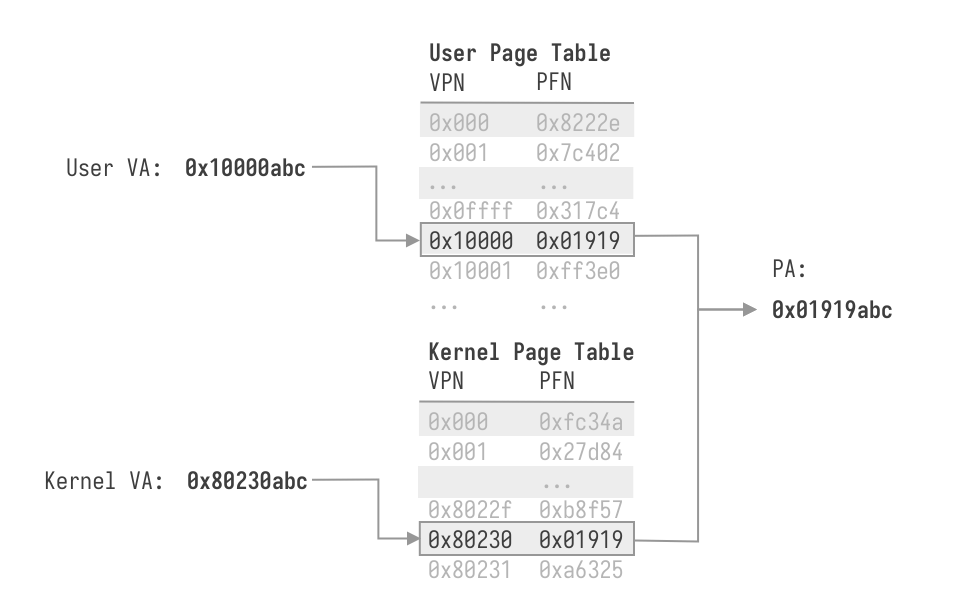

---
title = "Page Tables are Easy... Or Are They?"
created = 2024-02-25
license = "CC BY-SA 4.0"
---

> **Prerequisites**: Programming Language (Languages with pointers like C are better), Data Structure, Computer Organization or Assembly Language


Recently I was developing an OS kernel on RISC-V, picking up the original project mentioned in my first post [Hello world](#test.md). The project is now mostly complete, but some essential features are missing, and many bugs are yet to be fixed. The git repo is at https://github.com/endaytrer/endros. Thank you so much if you can post issues and PRs to this project!

Thanks to this opportunity, I can delve more deeply into the concept of virtual memory. This post is to share my understanding of page tables, the modern way of virtual memory managing.


## What is a Page Table?

In modern OSes, processes lives in an unrealistic utopian world. They think they owned the whole address space, and other processes are simply non-existance.

On the other hand, actually there are a lot of processes running concurrently. The problem is, when multiple processes is refering to the same address, how to make sure that they get the correspondent address space?

For example,

```c
// Process 1
int *p = (int *)0x100000000;
*p = 0xdeadbeef;
sleep(1);
printf("%x\n", *p);
```

```c
// Process 2
int *p = (int *)0x100000000;
*p = 0xcafebabe;
sleep(1);
printf("%x\n", *p);
```

The two processes are all trying to modify the integer stored at `0x100000000` differently. How to make sure that process 1 gets `0xdeadbeef` and process 2 gets `0xcafebabe`?

Historically, there are many other approaches such as **Static Relocation**, **Base-and-Bound**, **Segmentation**. They are really important for us to understand virtual memory, and why page tables are invented. However, they are not the topic in this post. If you are interested, there are material in [Operating Systems: Three Easy Pieces](https://pages.cs.wisc.edu/~remzi/OSTEP/) for you, and correspondent links are here (great shoutout to Prof. Remzi H. Arpaci-Dusseau!):

- Address Spaces: https://pages.cs.wisc.edu/~remzi/OSTEP/vm-intro.pdf
- Address Translation: https://pages.cs.wisc.edu/~remzi/OSTEP/vm-mechanism.pdf
- Segmentation: https://pages.cs.wisc.edu/~remzi/OSTEP/vm-segmentation.pdf

The approach we are using, which is also used by most modern operating systems, is **Page Tables**. Basically, Processes are using **virtual addresses (VA)**, and then translated into **physical addresses (PA)** which is used by hardware. In this way, diffenent processes can have the same virtual addresses, then translated to different physical addresses, making processes' address space isolated.

How does page tables translate virtual addresses to physical addresses?

The simplest way is to make a table, listing the physical address corresponding to each virtual address. I forged a name **Address table**, because literally nobody uses it:

**Address Table**

| VA           | PA           |
| ------------ | ------------ |
| `0x00000000` | `0x42fbe091` |
| `0x00000001` | `0x6cd0c7c9` |
| `0x00000002` | `0x000c2b79` |
| ...          | ...          |
| `0xffffffff` | `0x432f1be8` |

To translate an address $x$, you find the $x$-th entry in the table, and the physical address is simply there.

This approach is simply too bad, because:

1. You need **8 times** more space to store the table than the actual data! (in 64-bit machines, 8 bytes are needed to describe an address of one byte data)
2. If you access contiguous virtual spaces, the physical addresses are scattered everywhere. Caches cannot predict what you want to visit, make accessing data extremely slow.

Inspired by the second drawback, instead of mapping a single VA to a single PA, we can map a range of VA to a range of PA. For example, mapping `0x00000000` to `0x00000fff` to physical space `0x7f823000` to `0x7f823fff`.

To make the translation as simple as possible, we make the last $k$ bits of a VA the same as the PA. That is equivalent to map $2^k$ addresses from VA $x\times 2^k$ (`0bXXXXX00...0(k zeros)`) to $(x+1)\times 2^k - 1$ (`0bXXXXX11...1(k ones)`)to PA $y\times 2^k$ (`0bYYYYY00...0(k zeros)`) to $(y+1)\times 2^k - 1$ (`0bYYYYY1...1(k ones)`).

In most cases, we define $k = 12$. That is we map $2^{12} = 4096$ bytes at a time. We call this size **Pagesize**, and the virtual addresses from $x\times 2^k$ to $(x+1)\times 2^k - 1$ makes up a **Page**. The last $k$ bits which are the same in VAs and PAs are called **Offset**, other bits in virtual addresses $x$ are called **Virtual Page Number (VPN)**, and the correspond bits in physical address $y$ are called **Physical Frame Number.**

Just like in the address table, we can also construct a table for translating VPN to PFN like this. This table now has an official name: **Page table**.

**Page Table:** $(k = 12)$

| VPN       | PFN       |
| --------- | --------- |
| `0x00000` | `0x42fbe` |
| `0x00001` | `0x6cd0c` |
| `0x00002` | `0x000c2` |
| ...       | ...       |
| `0xfffff` | `0x432f1` |

Let's go through the process to translate VA `0x00001c38` to PA:

1. What is the **VPN** for this address?

   The VPN (upper $64 -k$ bits) of the address is bit $[63, 12]$: `0x00001`

2. What is the corresponding **PFN**?

   We look up the page table and find out that VPN `0x00001` corrensponds to PFN `0x6cd0c`

3. Making up a physical address

   We keep the **offset** (lower $k$ bit), or `0xc38` the same, and concat PFN to offset: `0x6cd0cc38`

Notice that VPN is not actually stored in memory. If we store 52-bit PFN in 8 bytes, for a VPN $v$ we need to translate, we just index into the page table into the $v$-th entry. Thus, we need only **1/512** of address space to store the page table! (Think about why?) Now we can fit multiple different page tables onto physical memory, and let each process have one. In this way, processes can have seperated address space.

Also, we didn't specify the length of PFN. You can map 52-bit VPN to 20-bit PFN, making the physical address space smaller than the virtual address space. That's why we have 64-bit computer, but typical PC's DRAM size is only 16GiB (34-bit address), 32GiB (35-bit address) or 64GiB (36-bit address).

On real hardware, page tables are implemented like this.

1. We store the start **Physical** address of page table in a dedicated register called **Page Table Base Register (PTBR)**. Suppose `ptbr = 0x100000`
2. Suppose we are visiting **Virtual** address `0x12345678`, take the VPN `0x12345`.
3. Each entry is **8** bytes, so the offset of the correspondent PFN entry is at $\mathrm{0x12345}\times 8 = \mathrm{0x91a28}$
4. The address of page table entry is the sum of page table base and offset:  `0x100000 + 0x91a28 = 0x191a28`
5. Read 8 bytes from **Physical** address `0x191a28`, and we get the PFN. Suppose it is `0x9abcd`
6. Concatenate PFN with the offset 0x678, we have the physical address `0x9abcd678`.



Pseudo code:

```c
PA translate(VA virtual_address) {
  // get VPN and offset from the virtual address.
  VPN vpn = virtual_address >> k;
  OFFSET offset = virtual_address & ((1 << k) - 1);
  
  // read vpn-th entry of page table
  PA<PTE> page table = (PA<PTE>)ptbr;
  PFN pfn = read_physical(page table[vpn], 8);
  
  // translate
  PA physical_address = (pfn << k) | offset;
  return physical_address;
}
```

Remember that this process is automatically done by **Hardware (Memory Management Unit, MMU)**, not by ourselves. When page tables are enabled, we always write code to visit the **Virtual address**.

```c
// visiting virtual address
int *x = (int *)(0x12345678);

// THERE IS NO WAY TO VISIT PHYSICAL ADDRESS!
```

However, in 64-bit address space, the size of page table is still insane: $2^{64}/512 = 32768\mathrm{TiB}$. Also, a process may only utilize few megabytes / gigabytes of memory, which is far less than the address space. There are multiple ways to address that, including simplying making page bigger (less VPNs), **segmented page table**, **inverted page table**, etc (https://pages.cs.wisc.edu/~remzi/OSTEP/vm-smalltables.pdf). The most used method, **Multi-level Page Tables** is discussed in next section.


## Multi-Level Page Tables (MLPT)

### Page Table Entries

In the last section, we stored the PFN in each entry of page table. In 64-bit virtual space and 64-bit physical space with page size 4096 bytes, only 64-12=52 bits in an entry stores the actual data, and 12 bits are unused. By making them flag bits, we can gain more control over the pages we mapped. The flags on different platform The most commonly used flags are:

1. **Read (R):** The page can be read.
2. **Write (W):** The page can be modified
3. **Execute (X):** Code on that page can be executed.
4. **Valid (V):** The page is mapped.
5. **User (U):** The page can be accessed in User mode.
6. **Present (P):** The page is in memory, not swapped onto disk.
7. **Dirty (D):** The page has been modified since last time the flag is cleared.

Now the entry in page table have two parts: PFN and flags, we cannot refer them as PFN anymore, so let's use its formal name: **Page table Entry (PTE)**

Present and dirty flags is for memory swapping, which is not in this post's scope, and user flag is always platform specific. Thus, we can make some pages (`.rodata`) readonly, some pages (`.text`) read and executable, some pages (`.data`, `.bss`) with read / write permission, and some pages not even exist.

If you build your own hardware, you can order PFN and flags into 8 bytes anyway you like. If you want to build on real platforms like x86_64, arm and RISC-V, you have to follow the specs in MMU. Here is an example.

```
63                                      31                            7654 3210
0000 0000 0000 0000 0000 0000 0000 0000 0000 0000 0000 0000 0000 0000 0000 0000
[                  Physical Frame Number [63:12]               ] ---- DPUH RWXV
```

In this example, bit[63:12] is for PFN, bits[7:0] is for flags. H is for **huge page**, it is also a useful flag that is will be mentioned a few sections later.

### Paging the Page Table

Now we have the ability to make some virtual memory region map to nothing by simply set the valid bit to zero; however we cannot shrink the size of page tables yet. Since we can mark some pages not exist, **why can't we mark some page tables not exist?** 

Firstly, **page tables should be divided into pages** like below. In most cases, since each page is 4096 bytes and PTE is 8 bytes, one page of page table only contains 512 entries:

**Page table Page 0 @ 0x10eb8000:**

| VPN       | PFN       | Valid | Flags |
| --------- | --------- | ----- | ----- |
| `0x00000` | `0x42fbe` | yes   | r-x   |
| `0x00001` | `0x6cd0c` | yes   | rw-   |
| ...       | ...       | ...   | ...   |
| `0x001ff` | /         | no    | /     |

**Page table Page 1 @ 0x10eb9000:**

| VPN       | PFN  | Valid | Flags |
| --------- | ---- | ----- | ----- |
| `0x00200` | /    | no    | /     |
| `0x00201` | /    | no    | /     |
| ...       | ...  | ...   | ...   |
| `0x002ff` | /    | no    | /     |

**......**

**Page table Page 2047 @ 0x116b7000:**

| VPN       | PFN       | Valid | Flags |
| --------- | --------- | ----- | ----- |
| `0xffe00` | /         | no    | /     |
| `0xffe01` | /         | no    | /     |
| ...       | ...       | ...   | ...   |
| `0xfffff` | `0x075a3` | yes   | r-x   |

Suppose that we only need three pages for a process: page with vpn `0x00000`, `0x00001` and `0xfffff`, we only need 2 pages of page table to exist: Page table Page 0 and Page table Page 2047. We need a way to mark the remaining pages of the page table to be invalid.

You can use any method including bitmap and freelist, or using virtual memory managing techniques to manage the page table just like regular memory, like base and bound (not applicable in this case) and segmentation.

Since we can apply any virtual memory managing techniques to manage page tables, **why can't we use page tables to manage page table pages?** By doing this, the page table pages can not only be unused, but also be non-contiguous.

When we observe into the VPNs in the page table pages above, we can see that:

- The lower 9 bits are the index of PTE from the base of the page table page, or I named it **Page table Index (PTI)**.
- The higher bits are the index of the page table page, or I named it **Page table Page Number (PPN)**.

For example address `0x12345678` has VPN `0x12345`  = `0b0001 0010 0011 0100 0101`, the lower 9 bits `0b1 0100 0101` = `0x145` is the index of PTE, and  the upper 11 bits `0b000 1001 0001` = `0x091` is the index of page table page. That means, the PTE is at the **325th (`0x145`) entry** of **page table page 145 (`0x91`)**.

Let's manage this with a page table with another page table-like table. To differenciate this with the page table mapping regular memory, we call this a **Page Directory**. The entries in page directories, are also named as **Page Directory Entry (PDE)**

| Page table Page Number (PPN) | PFN of the Page table Page | Valid | Flags |
| ---------------------------- | -------------------------- | ----- | ----- |
| 0x000                        | 0x10eb8                    | yes   | rw-   |
| 0x001                        | /                          | no    | /     |
| ...                          | ...                        | ...   | ...   |
| 0x7ff                        | 0x10eb9                    | yes   | rw-   |

In this way, we can allocate only page table page 0 and page table page 2047. Comparing to simple page tables, we have only $(8+2)\times 4096 = 40\mathrm{kiB}$ space to store the page table, instead of $32768\mathrm{TiB}$! (Why there is 8 + 2 pages?) That is a significant improvement.

Just like in page tables, page table page numbers are not stored in memory, we just use the page table page number to index into the page directory. Therefore, we have an identical structure for page table's PTE and page directories' PDE: PFN and flags.

Since we can know every page table page's PA in the page directory, we only need to store the **page directory base address** in the **PTBR** register.

Mimic the process of translating address in a single level page table, let's find out how to translate a virtual address `0x12345678` into physical address.

1. Split the VA into **VPN** `0x12345` and **offset** `0x678`.
2. Find the **PTE** of **VPN** `0x12345`:
   1. Split the VPN into **PPN** and **PTI**: PPN = `0x91`, PTI = `0x145`
   2. Find the **PDE** of **PPN** `0x91`:
      1. Each **PDE** is 8 bytes, so the offset of the correspondent **PDE** of **PPN**`0x91` is at $\mathrm{0x91}\times 8 = \mathrm{0x488}$
      2. Read the page directory base address from PTBR (suppose is at `0x10eb0000`)
      3. Add PDE offset to it: `0x10eb0000 + 0x488 = 0x10eb0488`, we have the physical address of **PDE** `0x10eb0488`
   3. Each **PTE** is 8 bytes, so the offset of the correspondent **PTE** of **PTI**`0x145` is at $\mathrm{0x145}\times 8 = \mathrm{0xa28}$
   4. Read 8 bytes from **PDE**'s Physical address `0x10eb0488`, and we get the PFN of the **page table page**. Suppose it is `0x01919`.
   5. Concatenate PFN of the **page table page** `0x01919` with the offset `0xa28`, we have the physical address of **PTE** `0x01919a28`
3. Read 8 bytes from **PTE**'s Physical address `0x01919a28`, and we get the PFN of the **actual page**. Suppose it is `0x9abcd`
4. Concatenate PFN of the **actual page** `0x9abcd` with the offset `0x678`, we have the physical address `0x9abcd678`.



You can clearly see the recursive pattern here. In fact, this can be easily flattened to a loop structure.

### More Levels

Above we demonstrate an virtual address space of 32 bits, or $4\textrm{GiB}$, and we need contiguous 8 pages to fit in the page directory. Modern 64-bit OS usually support more virtual address space. In most x86_64 / arm64 machine, 48-bit address is often used (Intel Ice Lake processor (or later) with Linux 4.14 (or later) optionally supports 57-bit address), and 39-bit for RISC-V64. In this case, the page directory becomes also inefficient.

Why don't we page that again and again, until the **highest-level page table fits in one page**?

Similary, we first we make the lower 9 bit of PPN the index into a page directory page (or Page Directory Index, PDI), and the table containing the mapping from page directory index to page directory page PFN is called Page Directory Pointers (PDP). The upper bits are called Page Directory Page Number (PDPN).

You might be confused about the names a lot before. Fortunately, after that, engineers of x86_64 also run out the names, and decided to name page tables, page directories, page directory pointers and all upper level page tables simply **Level-x Page tables**, and the index into them are called **Level-x VPN**.

Finally, we have 64-bit virtual address structures: (example of 4-level page table)

```
63                  47          38          29          20          11
0000 0000 0000 0000 000 000 000 000 000 000 000 000 000 000 000 000 000 000 000 000
[     Reserved    ] [  L4VPN  ] [  L3VPN  ] [  L2VPN  ] [  L1VPN  ] [   Offset    ]
```

You can find out that both level-x VPN's and offset's bit width are a multiple of 3 bits. Using **Octal numbers** is easier here. For example: If L4VPN = 0o123, L3VPN = 0o456, L2VPN = 0o701, L1VPN = 0o234, Offset = 0o3472, the VA is:

```
0o123 456 701 234 3472 = 001 010 011 100 101 110 111 000 001 011 100 111 010
```

Algorithm for translating 4 level page table (pagesize $2^k$, pseudo code):

```c
PA translate(VA virtual_address) {
  PA page_base = ptbr;
  
  for (int level = 4; level > 0; level--) {
    // get the index into current level page table
    int index = virtual_address.vpn.index_level[level];
    
    // read the page table entry
    PTE pte = read_physical(page_base + index * sizeof(PTE), sizeof(PTE));
    page table_base = pte.pfn << k;
  }
  
  return page_base | virtual_address.offset;
}
```

### Epilogue of This Section

As page tables are established, we are constructing a **map** between VPN and PFN. It is like a binary search tree (BST) we learned in data structure lesson, but there are only 4 (or less) layers, and one layer have 512 branches.

The page table is more like a multi-level **hash table**. Level-x VPN is used as the hash, and to resolve collision, we use another hash table with a different hash: a lower level VPN. Eventually, there is no collisions.

Just like building a data structure, the page table also have 4 basic operations (CRUD):

- **Create: **Map a VPN to PFN
- **Retrieve**: Walk through the pagetable to get PFN of a VPN
- **Update**: Remap a physical page from VPN x to VPN y.
- **Delete**: Free a physical page by unmapping its VPN.

This section only contains how to retrieve PFN from a page table, that is only 1/4 of the operations. In the next section, we will try to manage page tables.

Remember these terminologies! They are used **A LOT** in the sections later, If you don't remember them, you will be confused.

- **VA**: Virtual Address

- **PA**: Physical Address

- **VPN**: Virtual Page Number

- **PFN**: Physical Frame Number

- **PTE**: Page Table Entry

- **PTBR**: Page Table Base Register

- **MMU**: Memory Management Unit

- **TLB**: Translation Lookaside Buffer 

  What the heck is TLB? It is a buffer in MMU to cache the PTEs. In most cases, it is transparent to us (the programmers), but if we change PTBR, we must flush the cache for consistency.

## Managing Page Tables

Remember that we emphasise that **when page tables are enabled, we always write code to visit the virtual address**. Page tables also lie in memory, so we must access the page tables by their virtual addresses. When we are writing PTEs, we also have to somehow know the **physical address** of one page we want to map. How to track PFN and VPN simultaneously?

### Don't Map the Kernel Space?

The prerequisite is **when page tables are enabled**, we always write code to visit the virtual address. So don't enable it when you are managing page tables! :)

It is the most efficient way, but when OS kernels are getting more complicated and coexisting with many processes, this approach often makes your memory management tricky. You loses all the permission controls enabled by PTE flags, and it is easier for you to accidentally corrupt user space's data.

### Identical Mapping: Feels Like No Mapping!

So let's enable page tables, but let's make the virtual address identical to physical address: $VA = PA$ (a.k.a Identical Mapping).

Since we have to allocate physical pages for the page table, let's introduce an **allocator**, which has two methods:

- `PFN palloc()`: get one free physical page, mark it as used, and return its PFN.
- `void pfree(PFN pfn)`:  mark the physical page free.

The allocator can be implemented in various ways:

- **Bitmap:** making a dedicated space in physical memory storing which physical pages are used, one bit for each page: 1 is used, 0 is free. On PCs with 64GiB RAM, the bitmap size is 2MiB, making it really large. Also, we need to search all the entries before we find a free page to allocate.
- **Stack Allocator: ** Maintaining a stack of freed pages, and the highest allocated physical page's PFN. Freeing a page simply pushes it onto the stack. If `alloc()` is called and the stack is not empty, poping one page from the stack and return it. If the stack is empty, increase the highest allocated page and return it. The drawback is you have to pre-determine the stack size, and when a lot of space is allocated then freed, the stack will be very large.
- **Freelist**: Instead of maintaining a stack of freed pages in the stack allocator approach, using a chained list, where nodes are a struct descibing the freed page, and the virtual address of next free page. There is no space overhead by doing this approach, but to access the data of a page, we need its virtual space, making freeing a page requires not only the PFN, but also the VPN.

Since we use identical mapping here, PFN and VPN are equal, eliminating the side effect of freelist, making it purely better.

Before we enable page tables. we have to set up the page table mapping. After we understand the structure of multi-level page tables, it is easy to construct multi-level page tables for identical mapping on your own:

1. **Allocate Level-4 Page Table **

   ```c
   PFN pt4 = palloc();
   ```

   We want to utilize the benefits of multi-level pagetables -- saving space, so we allocate spaces for page tables in a lazy way: if the page table we need for mapping a page does not exist yet, creating it.

   Level-4 page table is not an exception. We have to map it as well.

   ```c
   void ptmap(VPN vpn, PFN pfn);
   ptmap((VPN)pt4, pt4);
   ```

2. **Mapping pages**

   Let's implement `ptmap`.

   ```c
   void ptmap(VPN vpn, PFN pfn) {
     PA page_base = pt4;
     for (int level = 4; level > 1; level--) {
       int index = vpn.index_level[level];
       
       // read the page table entry
       PTE *pte = (PTE *)(page_base + index * sizeof(PTE));
       PFN next_pfn;
       if (!pte->valid) {
         next_pfn = palloc();
         *pte = PTE(next_pfn);
         ptmap((VPN)next_pfn, next_pfn);
       } else {
         next_pfn = pte->pfn;
       }
     }
     int index = vpn.index_level[1];
     PTE *pte = (PTE *)(page_base + index * sizeof(PTE));
     *pte = PTE(pfn);
   }
   ```

   It is mostly similar to translating VPN to PFN, but since we are identically mapping the pages, the `read_physical` can be replaced with reading virtual address. Also, we are creating the pages and map identically if they do not exist.

   It contains a recursive call to itself. Will it overflow the stack when its is first called after `pt4 = palloc()`? Let's verify that by emulating the call stack. Suppose no pages are freed yet, and first `palloc` returns `0`.

   ```c
   ptmap(0, 0) {
     // level = 4,index = 0
     // valid = false
   	palloc() // returns 1
     ptmap(1, 1) {
     	// level = 4,index = 0
     	// valid = true
     	// level = 3,index = 0
     	// valid = false
     	palloc() // returns 2
     	ptmap(2, 2) {
     		// level = 4,index = 0
     		// valid = true
     		// level = 3,index = 0
     		// valid = true
     		// level = 2,index = 0
     		// valid = false
     		palloc() // returns 3
   	  	ptmap(3, 3) {
     			// level = 4,index = 0
     			// valid = true
   	  		// level = 3,index = 0
     			// valid = true
     			// level = 2,index = 0
     			// valid = true
     			return;
   			}
    			return;
       }
     	// level = 2, index = 0
     	// valid = true
     	return;
     }
     // level = 3, index = 0
   	// valid = true
     // level = 2, index = 0
     // valid = true
   	return;
   }
   ```

   That shows if no pages are ever freed, call to `ptmap()` are save.

   But it is not always this case. Suppose `palloc()` returns `0, 512, 1024, 1536, ...`:

   ```c
   ptmap(0, 0) {
     // level = 4,index = 0
     // valid = false
   	palloc(); // returns 512
     ptmap(512, 512) {
     	// level = 4,index = 0
     	// valid = true
     	// level = 3,index = 0
     	// valid = false
     	palloc(); // returns 1024
     	ptmap(1024, 1024) {
     		// level = 4,index = 0
     		// valid = true
     		// level = 3,index = 0
     		// valid = true
     		// level = 2,index = 2
     		// valid = false
     		palloc(); // returns 1536
   	  	ptmap(1536, 1536) {
     			// level = 4,index = 0
     			// valid = true
   	  		// level = 3,index = 0
     			// valid = true
     			// level = 2,index = 3
     			// valid = false
           palloc(); // returns 2048
           ptmap(2048, 2048) {
     				// level = 4,index = 0
     				// valid = true
   	  			// level = 3,index = 0
     				// valid = true
     				// level = 2,index = 4
     				// valid = false
     	      palloc(); // returns 2048
   	        ptmap(2560, 2560) {
     					// level = 4,index = 0
     					// valid = true
   	  				// level = 3,index = 0
     					// valid = true
     					// level = 2,index = 5
   	  				// valid = false
             	...
   ```

   and in this case it may not return before stack overflow! So it is really dangerous to map pagetables identically.

However, identical mapping is still necessary. Imagine that we are enabling paging after setting up the page table, but the code to enable paging is at a page that is not identically mapped. Now following pseudo assembly code is running:

```
			| PA            Instruction           |
		  |-------------------------------------|
pc -> | 0x80200fe0    mov ptbr, pt4base[pc] |
			| 0x80200fe4    flush tlb             |
      | 0x80200fe8    ld r0, 0x30[pc]       |
      | 0x80200fec    add r0, r1            |
      | 0x80200ff0    st r0, [0x80201000]   |
```

after `mov ptbr, pt4base[pc]`, the physical address of page table base is loaded to PTBR, and paging is enabled, the program counter PC = PC + 4 = `0x80200fe4`.

However, since paging is now enabled, the PC register are not referring to physical space anymore. Instead, it is pointing to VA `0x80200004`. If VPN `0x80200` is valid, the computer will execute the garbage stored in the physical space it maps to. Otherwise, if VPN `0x80200` is invalid, the machine will simply experience a page fault.

So, some part of our code should be identically mapped. You can identically map all the kernel's loadable pages, or let the bootloader load itself identically, enable paging, and loading the kernel to designated virtual space. For simple kernels, mapping its loadable segments identically is the simplest way.


### Fixed Offset

In identical mapping, the propose is that we can have a subset of virtual address space $C\subseteq V$, where there exist a bijective function from the subset to the physical space: $\exist f: C\tilde{\rarr} P$. In identical mapping, the subset $C = P$, $f: x\mapsto x$. But we are not limited to this specific configuration.

For example, an improved yet still simple way is **Fixed Offset: ** mapping the virtual address space from $t$ to $t + N$ to physical address 0 to N. Formally:
$$
C = \set{p + t\ |\ \forall p\in P} \\
f: x\mapsto x - t
$$
It did not improve anything in the pagetable recursive mapping problem, but it enables us to plan more carefully of virtual address range $[0, t)$. So, if we map the whole physical address space to very high virtual address space, and with careful setup of a boundary between low virtual address space and high fixed offset mapped space, the kernel code can be quite safe. So, mostly people use fixed offset to **map all physical address space at once.**

If there is no modification to the multi-level page table machenism above, obviously, it is not possible to create all 4-level page tables at once, because they take up too much space. Fourtunately, most MMUs today support **Huge Pages**, enabling us to use only one page of level 4 page table to map the whole physical spaces.

#### Huge Pages

Let's look back at how virtual address are made up with.

```
63                  47          38          29          20          11
0000 0000 0000 0000 000 000 000 000 000 000 000 000 000 000 000 000 000 000 000 000
[     Reserved    ] [ L4Index ] [ L3Index ] [ L2Index ] [ L1Index ] [   Offset    ]
```

In previous sections, I always implies that a page has a size of 4096 bytes, and the offset has 12 bits. A page size of 4kiB gives us fine control over the size we want to allocated to a process, but this is clearly not for the case when we want to allocate large size of pages rapidly. Since both situations are useful in kernel programming, is there a way to incorporate variable page sizes but keep the simplicity of multi-level page tables? Therefore, **Huge Pages** are invented. It allows us to stop when visiting level $k$ page table's entry, and treat all the indexes after an offset.

As a result, we can have 12-bit offset (page size 4kiB), 12+9 = 21-bit offset (page size 2MiB), 12+9+9 = 30-bit offset (page size 1GiB) and 12+9+9+9 = 39-bit offset (page size 512 GiB). The huge page mechanism is implemented like below:

```c
PA translate(VA virtual_address) {
  PA page_base = ptbr;
  
  for (int level = 4; level > 0; level--) {
    // get the index into current level page table
    int index = virtual_address.vpn.index_level[level];
    
    // read the page table entry
    PTE pte = read_physical(page_base + index * sizeof(PTE), sizeof(PTE));
    
+   // if it is a huge page, just return;
+   if (pte.huge) 
+     return (pte.pfn << (k + (level - 1) * 9)) | virtual_address & ((1 << (k + (level - 1) * 9))) - 1);
    
    page table_base = pte.pfn << k;
  }
  
  return page_base | virtual_address.offset;
}
```

We only need to add two more lines here. In short, if the PTE has huge flag, we directly concatenate the PFN to all the untranslated indices and offset.

For example, let's translate VA `0xffc1234567`

```
63                  47          38          29          20          11
0000 0000 0000 0000 000 000 001 111 111 111 000 001 001 000 110 100 010 101 100 111
[     Reserved    ] [ L4Index ] [ L3Index ] [ L2Index ] [ L1Index ] [   Offset    ]
```

The components are listed below:

- L4 Index: `0x001`

- L3 Index: `0x1ff`

- L2 Index: `0x009`

- L1 Index: `0x034`

- Offset: `0x567`

**Level 4 Page Table**

| L4 Index | PFN       | valid | flags |
| -------- | --------- | ----- | ----- |
| `0x0`    | `0x8023e` | true  | -r-x  |
| `0x1`    | `0x8023f` | true  | -rw-  |
| ...      | ...       | ...   | ...   |

**Level 3 Page Table @ 0x8023f000**

| L3 Index | PFN   | valid | flags    |
| -------- | ----- | ----- | -------- |
| `0x0`    | /     | false | /        |
| ...      | ...   | ...   | ...      |
| `0x1ff`  | `0x3` | true  | **h**rw- |

When we walk in level 4 page table, we did not encounter a huge page flag. So, continue normally, finding `0x1ff` = 511th PTE of the level 3 page table at `0x8023f000`.

When we walk in level 3 page table, we encontered a huge page flag. So, we stop here, concatenating PFN `0x3` to L2 Index, L1 Index and Offset. The physical address is: `11 000001001 000110100 010101100111` = `0xc1234567`.

In this situation, we only allocated 2 pages of pagetable, to map 1GiB of data. If we mark PTE in level 4 page table with huge flag, we can even directly map 512 GiB of data! that is enough for most PCs.

Thus, we can do the fixed offset mapping in just two lines of pseudo code:

```c
PFN pt4 = palloc();
*(PTE *)((pt4 << k) + t * sizeof(PTE)) = PTE(0, PTE_HUGE);
```

If you want to waste less virtual space, you can allocate one more page of level 3 page table, finding out the PFN of some PTEs, and mark those PTE huge. There is a tradeoff between more virtual space or more physical space. Since in most cases virtual address space is much cheaper than physical address space, mapping one level 4 PTE is great enough.

It is clear how to translate between fixed offset mapped VPN and PFN. Give it a try:

Suppose `t` = `0x0ff`, and the physical memory space is 4GiB. How to access the place with physical address `0xdeadbeef`?


> Answer: 0x7f80deadbeef, 0000 0000 0000 0000  0111 1111 1000 0000 1101 1110 1010 1101 1011 1110 1110 1111


## Recursive Page Table

All in all, having a large space identically (or with a fixed offset) mapped to physical memory space is still dangerous and hard to manage. Let's recap what we are doing above to find a new way.

There are various ways to manage regular pages: freelists, bitmap, etc.. The thing is, we can **manage VPN and PFN simultaneously**, and **pages do not depend on each other**. The hardest point memory management is to manage page tables: higher-level page tables only have PFN of lower level page tables, and they are correlated with each other. Also, although there is only a single Level-4 Page Table, but there is a large number of Level-3, Level-2, and Level 1 page tables we need to manage.

The graph below shows how we get the VA of PTEs in ordr to manage them:



Above we are trying to **map** the page table, and use a predetermined function to calculate the VPN correspoding to PFN in PTE. The thing is, we are too honest here. We obey all the rules and follow all the steps given by MMU, but MMU are designed for regular pages, not page tables.

But now, let's a different perspective -- trick the MMU!

Consider that **page tables are pages** as well, and PTEs in all levels of page tables have the same structure: PFN and flags. In addition, the steps to visit a page:

1. Read level 4 page table, index by level 4 VPN, we get PFN of level 3 page table
2. Read level 3 page table, index by level 3 VPN, we get PFN of level 2 page table
3. Read level 2 page table, index by level 2 VPN, we get PFN of level 1 page table
4. Read level 1 page table, index by level 1 VPN, we get PFN of the page
5. Access the page, index by offset.

The MMU always do **4 translations** to get a page. By design, the translation is done in L4, L3, L2 and L1 page table:

- we translate in L4 page table to get L3 address
- we translate in L3 page table to get L2 address
- we translate in L2 page table to get L1 address
- we translate in L1 page table to get page address

What if we translated in page table **one more time?** Let's find out what the steps become.

1. Read level 4 page table, index by level 4 VPN, we get PFN of level **3.5** page table
2. Read level **3.5** page table, index by level 3 VPN, we get PFN of level **3** page table
3. Read level **3** page table, index by level 2 VPN, we get PFN of level **2** page table
4. Read level **2** page table, index by level 1 VPN, we get PFN of level **1** page table
5. Access level **1** page table, index by offset.

If there is a page table set between level 4 page table and level 3 page table, we traveled in the page table one more time, so that **the MMU does not have the chance to translate in level 1 page table**! It thinks, finally after 4 translations, it is at the page we need to visit. It then concatenate PFN and offset to get PA we need to visit. What it doesn't know is, it is still on level 2 page table, and the PFN it gets is the PFN of level 1 page table!

In this way, without any mapping of page table pages, we can access L1 page table. The only question remained is, what is the level 3.5 page table?

Of course you can create another page for level 3.5 page table and filling PTE to L3 page tables. But there are already an page table that is full of PTE to L3 page tables: **Level 4 page table**!

That is to say, there is an PTE in Level 4 page table **that points to itself**. So we called this approach **Recursive Page Table**. The PTE that points to the level 4 page table it self is called **Recursive Entry**. The image below is a visualization of how to visit L1 page table's PTE in recursive page table.



Since every PTE is 8 bytes, the lower 3 bit of offset must be 0. The higher 9 bits are natually the L1VPN we want to access.

So if we want to the PTE of VPN $[\mathrm{vpn}_4, \mathrm{vpn}_3, \mathrm{vpn}_2, \mathrm{vpn}_1]$ , we access the address:
$$
[\textrm{recursive\_entry}, \mathrm{vpn}_4, \mathrm{vpn}_3, \mathrm{vpn}_2, \mathrm{offset}=\mathrm{vpn}_1 \times 8]
$$


Now we can access level 1 page table. What about level 2, 3, 4? Above we visit L4 page table one more time to delay the access to actual page once. It is easy to imagine that, if we visit L4 page table three times, we can delay the access to actual page twice, so that after 4 translations, we are visiting L2 page table. Let's see if this is the case:

1. Read level **4** page table, index by recursive entry, we get PFN of level **4** page table
2. Read level **4** page table, index by recursive entry, we get PFN of level **4** page table
3. Read level **4** page table, index by level 4 VPN, we get PFN of level **3** page table
4. Read level **3** page table, index by level 3 VPN, we get PFN of level **2** page table
5. Access level **2** page table, index by level 3 VPN.

That is exactly what we want. Similarly, accessing L4 page table 4 times give us access to L3 page table, and accessing L4 page table 5 times give us access to L4 page table.

**Level 3 Page Table:**

1. Read level **4** page table, index by recursive entry, we get PFN of level **4** page table
2. Read level **4** page table, index by recursive entry, we get PFN of level **4** page table
3. Read level **4** page table, index by recursive entry, we get PFN of level **4** page table
4. Read level **4** page table, index by level 4 VPN, we get PFN of level **3** page table
5. Access level **3** page table, index by level 3 VPN.

**Level 4 Page Table:**

1. Read level **4** page table, index by recursive entry, we get PFN of level **4** page table
2. Read level **4** page table, index by recursive entry, we get PFN of level **4** page table
3. Read level **4** page table, index by recursive entry, we get PFN of level **4** page table
4. Read level **4** page table, index by recursive entry, we get PFN of level **4** page table
5. Access level **4** page table, index by level 4 VPN.

Suppose the recursive entry is `0x1ff`, here are some examples of accessing page tables by their virtual address:

1. Level 4 Page Table, PTE with L4VPN `0x3`:

   $[\textrm{0x1ff}, \textrm{0x1ff}, \textrm{0x1ff}, \textrm{0x1ff}, \textrm{0x3}\times 8]$ = `0xffff ffff f018`

2. Level 3 Page Table with L4VPN `0x3`, PTE with L3VPN`0x1d3`:

   $[\textrm{0x1ff}, \textrm{0x1ff}, \textrm{0x1ff}, \textrm{0x3}, \textrm{0x1d3}\times 8]$ = `0xffff ffe0 3e98`

3. Level 2 Page Table with L4VPN `0x3`, L3VPN`0x1d3`, PTE with L2VPN`0x1`:

   $[\textrm{0x1ff}, \textrm{0x1ff}, \textrm{0x3}, \textrm{0x1d3}, \textrm{0x1}\times 8]$ = `0xffff c07d 3008`

4. Level 1 Page Table with L4VPN `0x3`, L3VPN`0x1d3`, L2VPN`0x1`, PTE with L1VPN`0xf`:

   $[\textrm{0x1ff}, \textrm{0x3}, \textrm{0x1d3}, \textrm{0x1}, \textrm{0xf}\times 8]$ = `0xff80 fa60 1078`

How elegent is a recursive page table! We've mapped all the page tables from different levels without explicitly mapping any of them, and you don't have to track their VPNs anymore! All you need to do is still only two lines of code:

```c
PFN pt4 = palloc();
*(PTE *)((pt4 << k) + recursive_entry * sizeof(PTE)) = PTE(pt4);
```


## User Page Table

Now we know how to manage page tables themselves with page tables enabled. But as an OS kernel, our biggest responsibility is to create a virtual address space for user space programs. What are we required to do to manage user virtual address space?

- **Creating a seperate set of page tables**. Every process have a different mapping from the same virtual address space to different physical address space. So we must create a seperate set of page tables for each process.

- **Marking the user pages as allocated**. We don't want to let other processes and ourselves to corrupt user space data, so the physical pages of both of user space page tables and other user space pages should be marked as allocated.

- **Mapping new pages afterwards if they require more heap space**. If we enable dynamic memory allocation for user space processes, their virtual address space is going to expand or shrink at runtime.

- **Freeing the page tables of a process after it is terminated**. As an OS kernel, we should avoid memory leakage after running for a long time. After a process is killed, its space should be reused by us.

- **Making user space data readable and modifiable for us**.

  This might seems unsafe, but it is a necessary evil. For example, if the process want to print "Hello world", it should let the kernel know where the string "Hello world" is. The program does it by placing a pointer pointing to the user address space as an argument in the correspondent system call ([What is a system call?](https://en.wikipedia.org/wiki/System_call)). As a kernel, we are using kernel address space, and the pointer (e.g. `0x12345678`), which originally points to an address  in user space, points to some garbage in kernel address space. We should map the user space pages to pages in kernel space, and translate the pointer $p$ to a new pointer $f(p)$, that correctly points to kernel address space.

Just like what we are doing in recursive page tables, but in this time, there is a real level 3.5 page table here: the user level 4 page table. With a combination of a recursive entry and an entry of user level 4 page table, we can access any level of user page table like this:

**User Level 1 Page Table**

1. Read **kernel level 4** page table, index by **user level 4 page table entry**, we get PFN of **user level 4** page table
2. Read **user level 4** page table, index by user level 4 VPN, we get PFN of **user level 3** page table
3. Read **user level 3** page table, index by user level 3 VPN, we get PFN of **user level 2** page table
4. Read **user level 2** page table, index by user level 2 VPN, we get PFN of **user level 1** page table
5. Access **user level 1** page table, index by user level 1 VPN


**User Level 2 Page Table**

1. Read **kernel level 4** page table, index by **recursive entry**, we get PFN of **kernel level 4** page table
2. Read **kernel level 4** page table, index by **user level 4 page table entry**, we get PFN of **user level 4** page table
3. Read **user level 4** page table, index by user level 4 VPN, we get PFN of **user level 3** page table
4. Read **user level 3** page table, index by user level 3 VPN, we get PFN of **user level 2** page table
5. Access **user level 2** page table, index by user level 2 VPN


**User Level 3 Page Table**

1. Read **kernel level 4** page table, index by **recursive entry**, we get PFN of **kernel level 4** page table
2. Read **kernel level 4** page table, index by **recursive entry**, we get PFN of **kernel level 4** page table
3. Read **kernel level 4** page table, index by **user level 4 page table entry**, we get PFN of **user level 4** page table
4. Read **user level 4** page table, index by user level 4 VPN, we get PFN of **user level 3** page table
5. Access **user level 3** page table, index by user level 3 VPN


**User Level 4 Page Table**

1. Read **kernel level 4** page table, index by **recursive entry**, we get PFN of **kernel level 4** page table
2. Read **kernel level 4** page table, index by **recursive entry**, we get PFN of **kernel level 4** page table
3. Read **kernel level 4** page table, index by **recursive entry**, we get PFN of **kernel level 4** page table
4. Read **kernel level 4** page table, index by **user level 4 page table entry**, we get PFN of **user level 4** page table
5. Access **user level 4** page table, index by user level 4 VPN


Now we have access to all the user page tables. That seems to be a good solution.

However, since we add one more translation by introducing user level 4 page table entry, we do not have access to the actual pages of user page table. 

Freeing the user pages can be a major problem. with only access to PFN of user pages, we cannot access the data in actual user pages, and we are not able to free them if we are using freelist. What's worse, creating a free node in user page table pages will corrupt them, making lower level page tables inaccessible.



The core problem is that we must access the user page table in a way without user page table. In other word, a physical user page is **mapped twice**: from user virtual address space $v_u\to p$, and in kernel virtual address space $v_k\to p$.



How?

### Temporary Mapping

The first approach is really simple:

1. Get the PA $p$ of a user VA $v_u$ by recursive page table with user l4pt entry
2. Get a free VA $v_k$ from kernel space.
3. map $v_k\to p$

It is really simple, but the drawback is that we do not have a structre for storing $v_k$. As we have done visiting the user page by $v_k$, we should unmap it as soon as possible, since we cannot get $v_k$ from $v_u$ and $p$ anymore. So, this approach is called **Temporary Mapping**.

That disables us to free all page tables and regular user pages entirely: we either can't free them, or can't reuse them after they are free.

### Inverted Page Table

To be honest, what we do here is still temporary mapping, but we can organize the structure of $v_k$ so that we can retrieve them afterwards.

Since we can retrieve the PA by walk through recursive page table with user l4pt entry ($v_u \to p$), if there is a structure that stores the map $p\to v_k$, we now have a way to get $v_k$ from $v_u$ (although it is a little convoluted).

Consider that there is no essential difference between virtual address space and physical address space, and we can use a page table to map VA to PA. Why can't we use a page table to map PA ($p$) to VA ($v_k$)?  This page table is naturally called **Inverted Page Table**.

All the techniques of shrinking page tables can be used for inverted page table: segmentation, multi-layer, etc.. We can also exploit the property of physical address space -- (mostly) contiguous and small -- to invent more structures: mixed page table with hash table, ...

The method of inverted page table tells us, **Page tables are just data structures.** We can modify them whatever we want, and combine them with other data structures to make them more suitable for the situation we are in.

The only difference between page tables and inverted PTs is, there is no hardware like MMU to automate this process for us, we must implement the walking process in software by ourselves. But the process is literally just replace PFN with VPN, and replace VPN with PFN:

1. Read level 4 inverted page table, index by level 4 PFN, we get VPN of level 3 inverted page table
2. Read level 3 inverted page table, index by level 3 PFN, we get VPN of level 2 inverted page table
3. Read level 2 inverted page table, index by level 2 PFN, we get VPN of level 1 inverted page table
4. Read level 1 inverted page table, index by level 1 PFN, we get kernel VPN of the page
5. Access the page by kernel VPN, index by offset.
