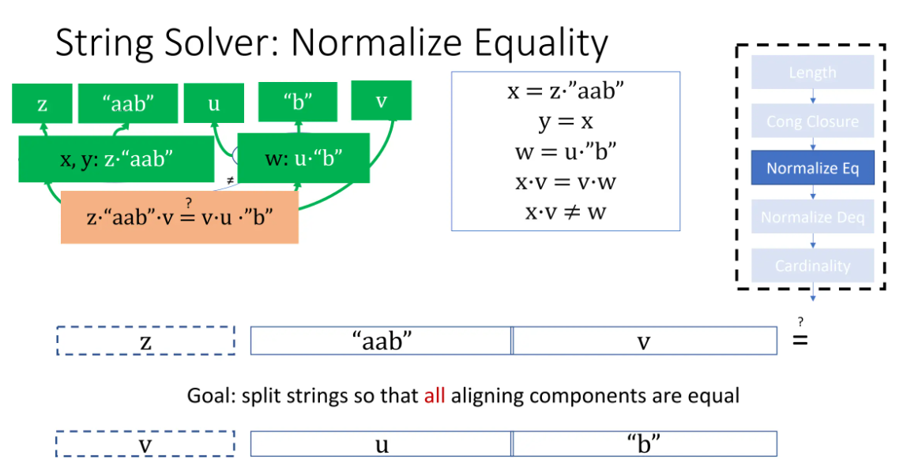
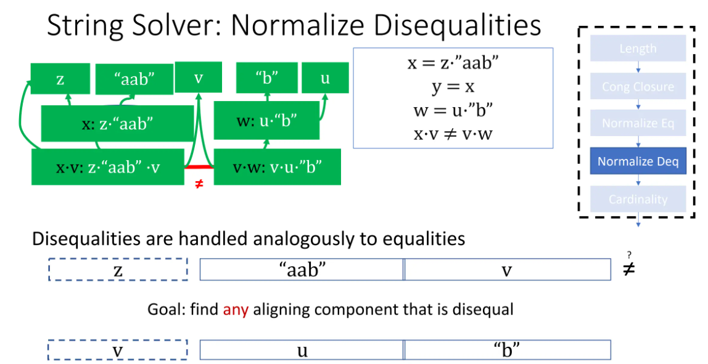
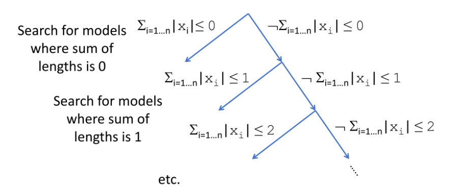
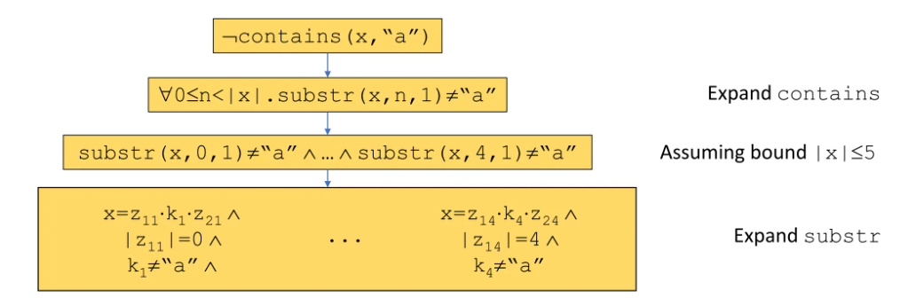
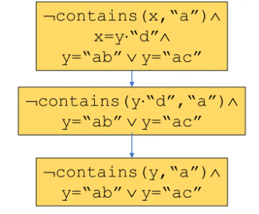

### Standard Pipeline

```
String Length -> Congruence Closure -> Normalize String Equalities -> Normalize String Disequalities -> Check Cardin
```

对于String theory理论组：

$$
\begin{align}
x &= z \cdot \textrm{``aab"} \\
y &= x \\
w &= u \cdot \textrm{``b"} \\
x \cdot v &= v \cdot w \\
x\cdot v &\neq w
\end{align}
$$

其中 “$\cdot$” 代表字符串连接操作。


### Length

对出现的每个字符串（常量或变量）提出长度引理，常量直接给出长度，变量的相等和连接转化为长度的算术关系：

$$
\begin{matrix}
|\textrm{``b"}| = 1, &|\textrm{``aab"}| = 3, &|x\cdot v| = |x| + |v| \\
|z \cdot \textrm{``aab"} | = |z| + 3, &|u \cdot \textrm{``b"} | = |u| + 1, &|v \cdot w | = |v| + |w| \\
x = \textrm{``"} \vee |x| \geq 1, &y = \textrm{``"}\vee |y| \geq 1,  &\cdots
\end{matrix}
$$

将新约束加入子句中，使用SAT求解器和Nelson-Oppen框架求解，以下亦是如此。

### Congruence Closure

将相等的terms整合为等价闭包：

$$
C_1=\{x, y, z\cdot \textrm{``aab"}\}, C_2=\{w, u\cdot \textrm{``b"}\},\\
C_3=\{x\cdot v, v\cdot w\},\\
\{z\}, \{u\}, \{v\}, \{\textrm{``aab"}\}, \{\textrm{``b"}\}
$$
其中由于不等关系，$C_1\neq C_2$

### Normalize Equality

**范式**：字符串的连接$r_1\cdot \cdots \cdot r_n$，其中每一个元均为所在等价类中的代表。
- base：
    1. 常量必须被选为该等价类的代表，即该等价类的范式即为此常量；
    2. 单个变量构成的等价类的范式即为这个变量。
- induction: 范式$r_1\cdot \cdots \cdot r_n$中的每一项，均为一个等价类的范式。

可以根据归纳法自底向上计算范式：
1. $z, u, v, \textrm{``aab"}, \textrm{``b"}$是范式。
2. 由于$z$和$\textrm{``aab"}$均为范式，$C_1$的范式为$z\cdot \textrm{``aab"}$；同理$C_2$的范式是$u\cdot \textrm{``b"}$。
3. 接下来替换$C_1$中的$x$为$z\cdot \textrm{``aab"}$, $w$为$u\cdot \textrm{``b"}$，此时无法判断是否等价类等价，需要分v和z长度关系讨论，讨论后重新构建等价类进行计算。



若在等价类中推出不等，即可直接输出unsat.


### Normalize Disequalities

和等式类似，通过构建范式去确保不等关系间两个等价类的范式不相等：




### Cardinality

对于有限字符集，需要确保理论可以被有限字符集构造出来；假设理论隐含了257个不同的长度为1的字符串，而字符集仅有256个字符，则理论是unsat的。


### 其他CVC5中的技术

#### Finite Model Finding for Strings

在搜索字符串空间时，通过限定字符串长度和之界来限界搜索。



#### Context-Dependent Simplification for Extended String Constraints

对于拓展字符串操作，例如子串，包含，取序号，替换操作的解决方式。

**朴素方法** 将拓展操作通过有界$\forall$谓词转化为基础操作:



简化操作：通过已知等价关系缩小搜索范围，例如：



Context-aware：通过string solver察觉到`contains(y, "a"), y = "ab"  y = "ac"`内部隐含的unsat。


#### Aggressive Simplifications for Strings

很多字符串隐含关系是十分非平凡的，例如
```
substr(x·"abcd", 1 + len(x), 2) = "bc"
```

将字符串的表达式转化为字符串长度的表达式等可以优先找出unsat的情况。